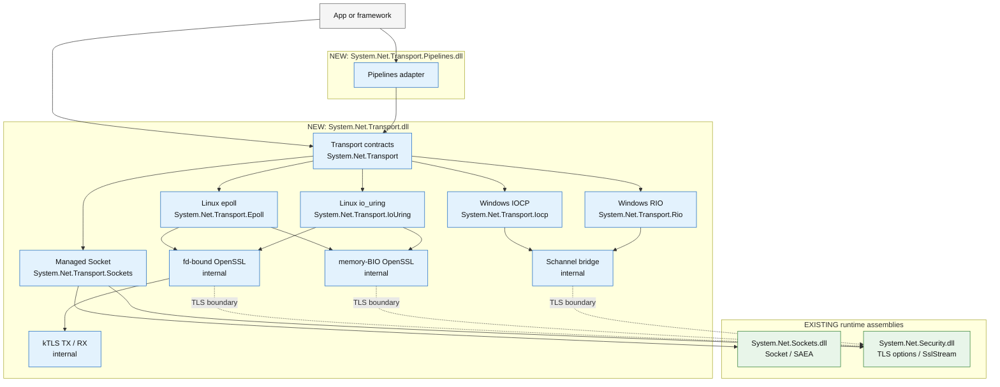
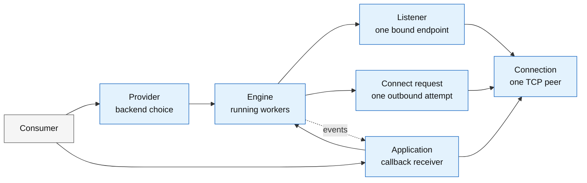

# Runtime-owned pluggable TCP transport proposal

> **Status:** Design proposal. The API names and signatures are illustrative, unapproved, and unimplemented.
>
> **Scope:** TCP byte streams and TCP with TLS. This is not a proposal for UDP, QUIC, HTTP semantics, or a general replacement for `System.Net.Sockets.Socket`.
>
> **Decision in one sentence:** Move reusable transport machinery into a runtime-owned experimental component, keep `Socket` and `SslStream` as the compatibility baseline, and introduce a provider-neutral connection abstraction only for semantics that those existing types cannot represent: shared backend ownership, provider-owned receive buffers, backend-neutral TLS lifecycle, and truthful offload state.

## Navigation

- [Proposed API and contracts](api.md)
- [Provider usage examples](examples/README.md)
- [SocketSet public API and layer map](socketset-public-api-map.md)
- [TLS option and callback parity](tls.md)
- [Backend mappings and primers](backends.md)
- [Requirement traceability](traceability.md)
- [Skeptical public API review](api-review.md)
- [Pinned sources](sources.md)
- [Signature and example compile harness](validation/README.md)

## Status vocabulary

This proposal uses four labels deliberately:

- **Verified current fact** means the statement was checked against a pinned source revision or versioned primary documentation listed in [sources.md](sources.md).
- **Proposal** means this document recommends the behavior or API.
- **Hypothesis** means the idea is plausible but needs measurement or implementation evidence.
- **Unimplemented** means no claim is made that the runtime or ASP.NET Core currently provides the behavior.

The user-provided planning context says DirectTLS is not intended for .NET 11. This document does not independently assert a release decision. It treats the current DirectTLS code as an experimental implementation study, not as an approved product direction.

## Executive recommendation

1. **Do not create a second public `Socket`.** Keep `Socket` as the concrete BSD/Winsock socket API, including its existing handle, option, datagram, synchronous, asynchronous, and compatibility surface.
2. **Do not make `Socket` provider-polymorphic.** Its public contract is tied to operating-system socket semantics, while an io_uring engine, an fd-bound TLS session, and a memory-BIO TLS pipeline have additional group lifetime and buffer ownership constraints that cannot be expressed by pretending each is just another `Socket` implementation.
3. **Introduce a narrow experimental `System.Net.Transport` surface owned by dotnet/runtime.** Its intended callers are server frameworks and high-performance client libraries, not ordinary application code. It models a connected, reliable, ordered byte stream; a provider owns shared execution resources; a listener accepts connections; and a connection exposes one read lane, one write lane, explicit TLS authentication, half-close, abort, and terminal completion.
4. **Use `Socket` plus `SslStream` as the mandatory fallback provider.** This preserves the broadest compatibility and the full existing `SslClientAuthenticationOptions` and `SslServerAuthenticationOptions` behavior. Native providers may optimize only when they can preserve the configured semantics.
5. **Treat TLS as part of the core contract.** A provider must support plaintext and TLS, either natively or through the runtime fallback. A provider must never silently ignore a TLS option or callback.
6. **Keep `System.IO.Pipelines` above the low-level transport.** A reusable adapter supplies Kestrel-style schedulers, ownership, backpressure, cancellation, and completion semantics. ASP.NET Core glue maps runtime state to Kestrel features without making runtime depend on ASP.NET Core types.
7. **Incubate before stabilization.** The initial API should be experimental. Stable BCL surface is not justified until a native provider demonstrates semantic parity, a non-Kestrel client demonstrates reuse, and measurements isolate a material benefit that cannot be obtained by improving `Socket`, `SslStream`, or their adapters internally.

## Requirements

The following identifiers are used throughout the proposal and in the final traceability table.

| ID | Requirement |
|---|---|
| R1 | Support plaintext TCP and TCP with TLS, with native TLS treated as a primary production path. |
| R1.5 | Preserve all relevant Kestrel TLS options and hooks, including raw ClientHello observation, certificate selection, per-connection authentication options, client-certificate validation, delayed client certificates, and post-handshake metadata. |
| R2 | Support pluggable epoll, io_uring, managed `Socket`, and Windows implementations. |
| R3 | Provide low-level accept, connect, read, write, handshake, shutdown, and abort contracts suitable for independent providers; justify every public primitive. |
| R4 | Fit fd-bound nonblocking OpenSSL and its `WANT_READ`/`WANT_WRITE` state transitions. |
| R5 | Leave io_uring free to use fd-bound TLS, memory-BIO TLS, multishot receive, provided buffers, polling, or hybrids; define buffer identity, cancellation, and terminal completion lifetimes. |
| R6 | Allow kTLS while distinguishing requested policy, negotiated TLS, actual TX/RX activation, and fallback. |
| R7 | Preserve ordinary NIC offloads and accurately describe optional hardware TLS offload without promising portable activation or zero-copy. |
| R8 | Prefer reuse of `Socket`, `SafeSocketHandle`, `SslStream`, Pipelines, and existing extension points; justify any new connection type and define migration and ownership. |
| R9 | Provide a reusable Pipelines adapter with direction-specific schedulers, bounded backpressure, concurrency, error, cancellation, abort, graceful shutdown, and lifetime contracts. |
| R10 | Support clients as first-class consumers, including long-lived multiplexed clients with explicit connect, TLS authentication, pooling, reconnection, and ownership boundaries. |

## Problem statement

### What exists today

**Verified current fact:** `Socket` already has broad synchronous and asynchronous accept, connect, receive, send, scatter/gather, shutdown, handle, and socket-option APIs. It can wrap a `SafeSocketHandle`; the handle explicitly records ownership. On Unix, the runtime's socket engine is readiness-based and normally dispatches work from its event thread to the CLR thread pool. On Windows, managed sockets bind their native handle to the thread pool's completion port. See [S-RUNTIME-SOCKETS](sources.md#s-runtime-sockets), [S-RUNTIME-UNIX](sources.md#s-runtime-unix), and [S-RUNTIME-WINDOWS](sources.md#s-runtime-windows).

**Verified current fact:** `SslStream` already exposes the complete supported client and server TLS configuration model, including per-ClientHello server option selection, certificate callbacks, chain policy, ALPN, protocol selection, revocation, resumption, cipher policy, and post-handshake client certificate negotiation on supported platforms. It permits one read and one write concurrently, but rejects concurrent operations in the same direction. See [S-RUNTIME-TLS](sources.md#s-runtime-tls).

**Verified current fact:** Kestrel's normal HTTPS path adapts an `IDuplexPipe` to a `Stream`, wraps it in `SslStream`, and adapts the `SslStream` back to `PipeReader`/`PipeWriter`. Kestrel separately configures the input and output pipe schedulers and backpressure thresholds. See [S-KESTREL-HTTPS](sources.md#s-kestrel-https) and [S-KESTREL-SOCKETS](sources.md#s-kestrel-sockets).

**Verified current fact:** The current experimental DirectTLS implementation demonstrates an fd-bound, nonblocking OpenSSL session driven by epoll. It also exposes the cost of an incomplete abstraction: duplicated endpoint/TLS configuration, a TLS-only transport, an ASP.NET-specific implementation, and a reconstructed non-owning `Socket` whose own source comments call it a sharp edge because raw I/O would corrupt the TLS stream. See [S-DIRECTTLS](sources.md#s-directtls).

**Verified current fact:** SocketSet demonstrates that a shared engine can host epoll, io_uring, managed SAEA, and Windows IOCP backends, can support both server and client operation, and can bridge to ASP.NET Core and a Redis-style client. It is useful feasibility evidence, not evidence that the same API should be standardized or that it is faster than current runtime paths. See [S-SOCKETSET](sources.md#s-socketset).

### The gap

The missing reusable unit is not another socket-shaped object. The gap is a runtime-owned contract for a **group-managed connected byte stream** where:

- the provider may own shared rings, completion ports, pollers, fixed files, buffer rings, and worker threads;
- a receive completion may select a provider-owned buffer whose identity and lifetime must survive until the consumer advances it;
- a transport can perform TLS in userspace, directly against a file descriptor, through an asynchronous ciphertext pipeline, or through Schannel;
- TLS option and callback behavior is validated centrally rather than independently re-created by each server transport;
- server and client libraries can use the same lifecycle;
- a reusable Pipelines adapter can preserve Kestrel's scheduler and backpressure requirements;
- capability requests such as kTLS are separated from the state actually negotiated and activated.

### Intended users

The primary audience is framework and infrastructure authors:

- ASP.NET Core/Kestrel transports;
- Redis, database, proxy, RPC, and messaging clients that maintain long-lived connections;
- runtime-owned native backend implementations;
- specialized provider authors with a concrete execution model.

Ordinary applications should continue to use `TcpClient`, `Socket`, `NetworkStream`, `SslStream`, `HttpClient`, or higher-level protocol libraries.

## Goals

- Let callers choose managed Socket, epoll, io_uring, IOCP, RIO, or an automatic default.
- Use the same server and client programming model with every provider.
- Notify the application when a connection is accepted, connected, receives data, finishes a write, or closes.
- Keep receive buffers valid for the duration of the receive callback.
- Let applications build and submit writes without creating a Task for every write.
- Configure TLS before a connection becomes ready, while preserving the existing .NET TLS options and callbacks.
- Make the managed Socket provider a normal implementation of the design, not a special fallback API.
- Keep provider-specific tuning on the provider that understands it.
- Put Task, Stream, Pipelines, and Kestrel convenience APIs above the low-level callback layer.
- Report unsupported behavior and failures clearly instead of silently ignoring options.

## Non-goals

- UDP, raw sockets, packet sockets, QUIC, SCTP, or arbitrary datagram semantics.
- Unix-domain sockets, named pipes, and other non-IP streams in the first surface; they can be evaluated later without weakening the TCP contract now.
- Reproducing every `SocketOptionName` on the provider-neutral connection.
- HTTP parsing, request scheduling, connection limits, or Kestrel-specific features in runtime.
- Connection pooling, load balancing, retry, or protocol multiplexing policy.
- A portable switch that configures kernel modules, privileges, drivers, NIC firmware, or `ethtool`.
- A promise that native backends outperform `Socket`; that requires controlled measurements.
- A `UseHttps`-style raw-byte middleware boundary for native TLS providers. When TLS is configured, the provider owns the socket and exposes only the ClientHello callback before authenticated plaintext.
- Public switches for choosing fd-bound OpenSSL, memory BIO, `SslStream`, or Schannel internals.
- A fake `SslStream` over a native TLS implementation.
- A stable public provider-specific tuning surface before implementation evidence exists.
- Cross-assembly `InternalsVisibleTo` or `UnsafeAccessor` access from ASP.NET Core into runtime implementation details.

## Proposed architecture



Diagram colors describe assembly placement: blue is a new assembly, green is an existing runtime assembly, and gray is consumer code. The dashed TLS arrows mark an unresolved implementation boundary.

### API and assembly placement

Preferred public placement:

| API | Namespace | Assembly |
|---|---|---|
| Core contracts | `System.Net.Transport` | `System.Net.Transport.dll` |
| Managed provider options | `System.Net.Transport.Sockets` | `System.Net.Transport.dll` |
| epoll provider options | `System.Net.Transport.Epoll` | `System.Net.Transport.dll` |
| io_uring provider options | `System.Net.Transport.IoUring` | `System.Net.Transport.dll` |
| IOCP provider options | `System.Net.Transport.Iocp` | `System.Net.Transport.dll` |
| RIO provider options | `System.Net.Transport.Rio` | `System.Net.Transport.dll` |
| Pipelines adapter | `System.Net.Transport.Pipelines` | `System.Net.Transport.Pipelines.dll` |

Existing dependencies:

| Existing API | Assembly |
|---|---|
| `Socket`, `SafeSocketHandle`, SAEA | `System.Net.Sockets.dll` |
| TLS options, certificates, `SslStream` | `System.Net.Security.dll` |

The provider implementation classes, epoll/io_uring/IOCP/RIO loops, fd-bound OpenSSL session, memory-BIO engine, Schannel bridge, and kTLS transition remain internal.

### Where should native TLS live?

There are three credible assembly choices:

1. **Put all transport code in `System.Net.Security.dll`.** This gives direct access to existing TLS internals, but places a large transport/provider API in an assembly whose name no longer describes its main purpose.
2. **Put transport code in `System.Net.Transport.dll` and use only public `System.Net.Security` APIs.** This is clean for plaintext and the `SslStream` fallback, but it cannot reuse the current internal fd-bound OpenSSL and Schannel machinery.
3. **Put transport code in `System.Net.Transport.dll` and create a deliberate TLS boundary.** That boundary could be a small experimental low-level API in `System.Net.Security`, or an internal refactor into a lower implementation component shared by both assemblies. This is the preferred direction to investigate because it keeps the public transport API in the expected assembly without duplicating TLS policy.

The design must not solve this with a new framework `InternalsVisibleTo` or `UnsafeAccessor`.

So, specifically, **fd-bound OpenSSL is internal implementation**, not a public class. A consumer selects epoll or io_uring and supplies TLS options; it does not construct an OpenSSL session.

## Runtime object roles



- **Provider:** describes which backend to use and holds its provider-specific options. It is cheap and does not represent a running server.
- **Engine:** the running instance created from the provider. It owns worker threads, rings or completion ports, buffer pools, listeners, and active connections.
- **Application:** only the callback receiver registered with the engine. It is not the whole user application. The name is tentative; `TransportHandler` or `TransportCallbacks` may be clearer.
- **Listener:** represents one bound endpoint. Disposing it stops new accepts without stopping the whole engine.
- **Connect request:** identifies one outbound connection attempt so success, failure, or cancellation can be matched to the caller.
- **Connection:** represents one accepted or connected TCP peer. The application uses it to send, pause/resume receiving, shut down, or abort. Incoming data arrives through the application callback.

The small connect/write operation values in the proposed API are simply **receipts**. A connect receipt lets an adapter match `OnReady` or `OnConnectFailed` to the original connect call. A write receipt lets it match `OnWriteCompleted` to the original flush. They do not own threads or native resources.

The contracts are intentionally layered:

1. `TransportProvider` owns shared backend resources.
2. `TransportListener` owns one bound listener.
3. `TransportApplication` receives accept, ready, receive, write-completion, close, and provider callbacks.
4. `TransportConnection` is stable connection identity, outbound writer, backpressure control, and metadata; it has no public read method.
5. TLS policy is selected before readiness and the provider drives the handshake, including ClientHello callbacks.
6. Task, Stream, Pipelines, and Kestrel APIs are adapters above the callback core.

The detailed signatures and member rationale are in [api.md](api.md).

## Core connection contract

### Receive

The provider invokes `TransportApplication.OnReceive(ref TransportReceiveContext)` with a borrowed `ReadOnlySpan<byte>`. The span is valid only for the callback. There is no task-based read operation and no caller-supplied read buffer in the low-level API.

This shape is deliberate:

- epoll can invoke the callback over its per-connection receive buffer;
- io_uring can invoke it over the CQE-selected provided buffer and return that buffer after the callback;
- IOCP/RIO can invoke it over the completed registered/overlapped buffer;
- the managed provider can invoke it from SAEA completion processing;
- `ref struct` callback contexts prevent the callback object and its buffer from being stored for later use.

An adapter that cannot consume synchronously copies or adopts the payload before returning. If it applies backpressure, it asks the connection to pause receiving and resumes it after downstream capacity returns.

### Write

`TransportConnection` implements `IBufferWriter<byte>`. The caller composes bytes into provider-owned memory and calls `Flush`, or uses a copying `Send` helper. `Flush` returns a `TransportWriteOperation` value used to correlate `OnWriteCompleted`.

The provider handles partial native sends internally and preserves logical write ordering. The core allocates no Task for write completion. A higher-level adapter can map operation IDs to Task completion sources.

### Completion and cancellation

`TransportEngine.Connect` returns a cancelable `TransportConnectOperation`. Connect success reaches `OnReady`; failure reaches `OnConnectFailed`. Cancellation does not permit the provider to recycle native state early: io_uring still requires the target operation's terminal CQE, and Windows still requires the overlapped completion to drain.

Receive has no per-callback cancellation token. The application controls flow through listener disposal, connect cancellation, `TryPauseReceive`/`ResumeReceive`, half-close, and abort. This is intentionally lower-level than `Socket.ReceiveAsync`.

### Shutdown

- `ShutdownRead` stops future receive callbacks.
- `ShutdownWrite` drains accepted writes, emits TLS `close_notify` when TLS is active, and performs transport write-half shutdown.
- `Abort` initiates immediate teardown.
- `OnClosed` carries the connection phase, close reason, and exception.
- listener and engine disposal are synchronous control-plane boundaries that drain their native operations before returning.

## TLS is a first-class lifecycle

TLS is configured on listener/connect options or in the pre-handshake accepting callback. The provider performs authentication before `OnReady`; application I/O begins only after that callback. The runtime implementation may use:

- `SslStream` over a transport-to-`Stream` adapter;
- fd-bound nonblocking OpenSSL;
- memory-BIO OpenSSL driven by asynchronous ciphertext I/O;
- Schannel token generation and record transforms;
- a userspace handshake followed by kTLS.

`OnAccepting` exposes stable connection identity before TLS authentication. A server framework can therefore apply connection accounting, handshake concurrency limits, timeouts, logging, load shedding, and per-connection TLS policy before expensive TLS work.

The application-facing TLS option objects reuse `SslClientAuthenticationOptions` and `SslServerAuthenticationOptions`. Native providers must snapshot and validate those options. They may not silently ignore an unsupported property. A provider has three valid choices:

1. implement the configured behavior;
2. use the `Socket`/`SslStream` compatibility path when provider selection is automatic;
3. fail with `NotSupportedException` naming the unsupported behavior when the provider was explicitly required.

TLS callback ordering, buffer lifetime, and the detailed compatibility matrix are in [tls.md](tls.md).

## Why this is not a second `Socket`

`TransportConnection` deliberately omits:

- address-family, socket-type, and protocol-type construction;
- bind/listen control;
- datagrams;
- raw handle access;
- arbitrary socket options and IOControl;
- blocking consumer read/write APIs;
- polling/select;
- sendfile and packet-specific operations.

It represents only the connected ordered-byte-stream lifetime needed by a provider-neutral server or client. `Socket` remains the concrete OS socket.

The new abstraction is justified only by semantics that do not fit `Socket`:

- a provider instance owns resources shared by many connections;
- receive memory can be selected by a completion and delivered as a borrowed callback span;
- the connection may be plaintext or a native TLS plaintext view over an encrypted socket;
- terminal completion controls safe reuse of operation and buffer identities;
- the provider may not have a managed `Socket` at all.

No part of this justification assumes that `Socket` has unacceptable object overhead or that virtual dispatch is a bottleneck. The current public `Socket` async methods are not a provider interface, and the proposed abstraction itself introduces polymorphic calls. Any claimed benefit must instead be tied to a measured mechanism such as fewer copies, fewer scheduler transitions, completion batching, registered-buffer reuse, or cheaper group lifetime management.

The semantic gaps and performance hypotheses are deliberately separated:

| Gap | Current limitation | Evidence status |
|---|---|---|
| Shared provider lifetime | A collection of ordinary `Socket` instances does not publicly represent one application-owned ring/poller/buffer-registration domain | Semantic gap |
| Completion-selected receive buffers | `Socket.ReceiveAsync(Memory<byte>)` requires the caller to provide the destination before completion | Semantic gap for io_uring provided-buffer/multishot designs |
| Native TLS plaintext view | `Socket` exposes ciphertext after TLS is layered above it; it cannot itself represent the authenticated plaintext connection | Semantic gap |
| Provider-neutral TLS/offload result | `SslStream` exposes negotiated TLS but no cross-provider kTLS TX/RX outcome | Semantic gap if offload becomes supported |
| Fewer scheduler hops | A shared native loop may reduce dispatch in some workloads | Hypothesis requiring measurement |
| Fewer copies | Direct pipe buffers, scatter/gather, or kTLS may avoid specific copies | Hypothesis requiring path counters and controlled benchmarks |
| Better throughput/latency | Native backend may outperform managed Socket | Not established |

### Naming

`TransportConnection` names the semantic role: one provider-owned connected ordered byte stream. It is not called `Socket`, `Socket2`, `NativeSocket`, or `AsyncSocket` because it does not expose the BSD/Winsock socket contract, and because asynchronous implementation is not the identity of the type. `TransportProvider` names the object that owns a transport implementation and its shared resources. `TransportListener` is the provider-owned accept source.

`TcpConnection` would be narrower but sits awkwardly beside the existing `TcpClient` and `TcpListener`, which expose a different object and ownership model. `StreamConnection` would imply a caller-driven `Stream`, while this connection receives through provider callbacks. The proposed names should remain experimental; API review can rename them after the semantics, not the novelty, are proven.

### Best counterargument

The strongest alternative is to add no new connection type:

- improve the runtime's internal `Socket` engine, including evaluating io_uring internally;
- continue using `NetworkStream` and `SslStream`;
- improve `PipeReader.Create`/`PipeWriter.Create` or Kestrel's adapters;
- expose only narrowly missing `SslStream` hooks, such as raw ClientHello observation or offload reporting.

That alternative has major advantages: no ecosystem split, no duplicate ownership rules, complete compatibility with existing libraries, and freedom for runtime to change implementation without public provider contracts.

The proposal therefore does **not** claim that a stable `TransportConnection` is already justified. It recommends an experimental runtime-owned component to determine whether shared-provider ownership, callback buffers, provider-specific tuning, and native TLS produce material, repeatable gains and enable real non-Kestrel consumers. If they do not, the correct outcome is to keep the improvements behind `Socket` and `SslStream`.

### Socket interop and ownership

The managed provider creates and drives ordinary `Socket`/SAEA instances behind the same callback API. Existing-Socket adoption is not in the revised core surface yet; if added, it requires explicit exclusive-I/O and disposal ownership rather than exposing a second active owner.

This avoids the sharp edge visible in the DirectTLS prototype: a non-owning `SafeSocketHandle` can be wrapped in `Socket`, but disposing that wrapper can still cancel its outstanding operations, and raw reads or writes bypassing TLS corrupt the record stream. See [S-DIRECTTLS](sources.md#s-directtls) and [S-RUNTIME-SOCKETS](sources.md#s-runtime-sockets).

Native providers create and own their handles. Transferring an existing `Socket` handle into a raw backend is deferred until there is an explicit, atomic ownership-transfer API; duplicating a descriptor is not equivalent because duplicated descriptors share underlying socket state, while retaining two active I/O owners is unsafe.

## Backend summary

| Backend | Plain TCP | TLS baseline | Native TLS opportunity | Main constraint |
|---|---|---|---|---|
| Managed `Socket` | Existing `Socket` async APIs | `SslStream` | Runtime may optimize internally | Broadest semantic compatibility; no claim that another backend is faster |
| Linux epoll | Nonblocking fd + level-triggered readiness | Memory-BIO fallback | fd-bound OpenSSL; optional kTLS | Every TLS operation may switch between wanting read and write |
| Linux io_uring | Accept/connect/send/recv CQEs, including multishot and provided buffers | Memory-BIO fallback | fd-bound OpenSSL driven by poll; optional kTLS | Buffer IDs, `F_MORE`, cancellation CQEs, and slot generations must outlive user cancellation |
| Windows IOCP | Raw Winsock overlapped operations and completion ports | `SslStream` or Schannel token/filter path | Runtime-owned completion batching and buffer ownership if evidence warrants | Overlapped state remains alive until terminal completion |
| Windows RIO | Registered buffers with RIO request/completion queues; TCP-only experimental provider | Schannel token/filter path | Explicit registered-I/O data path for measured workloads | Narrower than IOCP, requires registered memory, is not the default, and is not a general io_uring equivalent |

See [backends.md](backends.md) for concrete mappings and unresolved io_uring choices.

## Pipelines and Kestrel

The Pipelines API is now deliberately **above** the callback core and is not part of the revised reference surface yet. A future `System.Net.Transport.Pipelines` adapter subscribes through a `TransportApplication` implementation and maps operation IDs to its own async waiters.

The baseline adapter has two pumps:

- receive side: `OnReceive` copies or adopts the borrowed payload into the inbound `PipeWriter`; an incomplete `FlushAsync` pauses the connection before returning from the callback or as soon as the provider permits;
- send side: an outbound `PipeReader` composes bytes through `TransportConnection`, calls `Flush`, and maps `TransportWriteOperation.Id` to `OnWriteCompleted`.

Backpressure remains real: the adapter calls `TryPauseReceive` when the application is behind and `ResumeReceive` after the flush drains. A provider that already armed multishot receives may deliver bounded completions already in flight, but it must stop rearming or cancel/park the receive before its configured bound is exceeded.

The adapter distinguishes four scheduler roles through two `PipeOptions` instances:

- inbound reader scheduler: resumes Kestrel/application code consuming network input;
- inbound writer scheduler: resumes the transport receive pump;
- outbound reader scheduler: resumes the transport send pump;
- outbound writer scheduler: resumes Kestrel/application code producing output.

For the current Kestrel-style default, application continuations use `PipeScheduler.ThreadPool`, while adapter work is scheduled so application code does not run on a provider loop unless explicitly requested. This preserves Kestrel's direction-specific scheduling intent.

ASP.NET Core glue remains responsible for:

- creating `ConnectionContext`;
- setting `ITlsConnectionFeature`, `ITlsHandshakeFeature`, and `ITlsApplicationProtocolFeature`;
- exposing `ISslStreamFeature` only when the actual backend is `SslStream`;
- mapping the Kestrel connection-abort and close notifications;
- selecting Kestrel's IO queues and memory pool;
- applying Kestrel handshake timeout and connection metrics.

## Server and client usage

The API document and [`examples`](examples/README.md) contain complete illustrative snippets. The essential server shape is:

```csharp
TransportProvider provider = TransportProviders.CreateDefault();

using TransportEngine engine = provider.CreateEngine(
    new TransportEngineOptions(),
    new EchoApplication());

using TransportListener listener = engine.Listen(
    new TransportListenOptions
    {
        EndPoint = new IPEndPoint(IPAddress.Any, 8443),
        Backlog = 512,
        NoDelay = true,
        Tls = serverTls,
    });
```

The provider invokes `OnAccepting`, drives the selected TLS handshake, invokes `OnReady`, and then delivers `OnReceive` callbacks. A client calls synchronous `engine.Connect(options)` and receives success through `OnReady` or failure through `OnConnectFailed`; a higher-level adapter can turn that operation handle into `ConnectAsync`.

For a Redis-style multiplexer, the provider is shared across many logical client connections. The protocol library owns request correlation, pooling, heartbeat, reconnect, and retry. The runtime transport owns only one physical connection, its I/O/TLS resources, and precise close/error notification. No throughput or latency advantage is asserted without measurements.

## Scheduling and callback isolation

The provider may complete work while a submission call is still on the stack. Callback ordering and reentrancy are part of the contract: callbacks for one connection are serialized, and application code must not block a provider loop that services unrelated connections.

TLS callbacks are serialized per connection and may run concurrently across connections. The provider does not hold its ring, epoll, completion-port, or TLS-session lock while invoking user code. A suspended handshake is represented explicitly and resumed on the owning backend context after the callback completes. The DirectTLS prototype's eventfd plus completion-queue pattern is one concrete feasibility example, not a mandated implementation.

The raw ClientHello callback is synchronous and must remain bounded. The async TLS options callback may suspend only that connection's handshake and runs away from shared provider-loop locks. Neither callback may start application I/O before `OnReady`. Callback exceptions fail that connection's handshake and never downgrade it to plaintext.

## Offload model

Ordinary network offloads and TLS offload are separate:

- checksum offload, TSO, GSO, GRO, and related segmentation/coalescing remain kernel/NIC policy for normal TCP;
- kTLS moves the TLS record layer into the kernel independently for TX and RX after a userspace handshake;
- Linux TLS hardware offload may then move crypto from host software to a capable NIC, depending on driver/device configuration;
- transport copy avoidance is a separate property of buffer ownership and send/receive APIs.

The proposal offers no "enable hardware TLS" switch. An unprivileged .NET process cannot truthfully promise to configure kernel modules, `ethtool`, firmware, driver resources, routing, or per-device policy. It requests kTLS record-layer use and reports what the provider can establish.

`Prefer` means fall back to userspace TLS and report the result. `Require` means authentication fails unless the requested direction is active. TX and RX are independent. Negotiated TLS protocol and cipher are reported separately from offload activation because they are inputs to eligibility, not proof of activation.

Even when kTLS is active, hardware acceleration may be unknown on a per-connection basis. Linux exposes useful namespace and device counters, but aggregate counters are not always a reliable per-connection attribution mechanism. The public status therefore permits `Unknown`; provider diagnostics can expose richer platform data.

See [tls.md](tls.md#ktls-and-hardware-offload) for the full contract.

## Incremental adoption path

### Phase 0: evidence and contract tests

- Freeze a backend-independent behavior suite covering plaintext, TLS, callbacks, cancellation races, buffer lifetime, shutdown, and reconnect.
- Measure the current Kestrel `Socket`/`SslStream` path as the control.
- Measure copies, allocations, scheduler hops, throughput, latency distributions, CPU, and memory under small-message, large-payload, slow-reader, and connection-churn workloads.
- Record whether each fast path was actually taken.

### Phase 1: runtime-owned experimental surface

- Add the core abstract contracts and the managed `Socket` provider in an assembly location that can reuse runtime TLS internals without `InternalsVisibleTo` or `UnsafeAccessor`.
- Add the Pipelines adapter.
- Use `SslStream` as the TLS implementation.
- Add a Kestrel experimental adapter without changing the default transport.
- Add a client proof through a long-lived multiplexed protocol.

This phase proves API semantics and reuse. It should not claim a performance win.

### Phase 2: Linux epoll provider

- Move the fd ownership, readiness loop, callback suspension, and fd-bound OpenSSL work into runtime.
- Preserve full options by falling back or rejecting unsupported configurations.
- Do not expose a fake `Socket`.
- Compare fd-bound and memory-BIO TLS under the same contract.

### Phase 3: io_uring provider

- Implement plaintext multishot accept/receive with buffer-ring lifetime tracking.
- Implement at least two TLS experiments: fd-bound readiness and memory-BIO asynchronous ciphertext I/O.
- Add kTLS only after the userspace paths are correct.
- Resolve the open questions in [backends.md](backends.md#io_uring-integration-questions) with measurements and failure-injection tests.

### Phase 4: Windows

- Keep managed `Socket`/`SslStream` as the required Windows implementation.
- Add a raw IOCP provider only if it demonstrates a benefit or semantic capability that the existing runtime socket engine cannot provide.
- Reuse runtime Schannel policy and certificate validation code; do not duplicate it in ASP.NET Core.

### Phase 5: stabilization decision

Stabilize only the smallest surface demonstrated by at least two independent consumers and multiple backends. Provider-specific tuning should remain experimental unless it expresses a portable semantic rather than an implementation accident.

## Acceptance criteria

The proposal should not be considered implementation-complete until all applicable criteria pass:

1. Plaintext echo, half-close, abort, peer EOF, connect failure, connect cancellation, and listener disposal behave identically across providers.
2. Receive callbacks are serialized per connection, borrowed payload is valid for exactly the callback, and logical writes complete in submission order.
3. No receive buffer ID or connection slot is reused before its callback and native terminal completion are finished.
4. Every property in the current `SslClientAuthenticationOptions` and `SslServerAuthenticationOptions` surface is implemented, explicitly rejected, or routed to the documented `SslStream` fallback.
5. Every Kestrel callback and feature in [tls.md](tls.md) has a passing parity test or an explicit bind-time incompatibility.
6. Application callback exceptions fail only the affected connection; application callbacks are documented as nonblocking provider-worker code, while async TLS option callbacks suspend only their handshake.
7. `TlsClientHelloBytesCallback` compatibility preserves current first-record bytes and lifetime; `UseTlsClientHelloListener` can retain its separate pre-handshake timeout; fragmentation remains explicitly detectable.
8. `Prefer` and `Require` kTLS tests cover TX-only, RX-only, both, and unavailable cases, with actual activation checked rather than inferred from configuration.
9. Hardware TLS status is never reported active without provider evidence; unknown remains unknown.
10. The Pipelines adapter proves bounded memory under a slow reader and preserves final buffered data on completion.
11. Client tests cover hostname validation, custom validation, client certificate selection, cancellation, server close, reconnect, and long-lived pipelining.
12. Performance claims, if any, include an in-process control, fast-path counters, multiple payload sizes, concurrency, tail latency, CPU, and memory. A clean correctness result is not a performance result.

## Explicit limitations and unresolved decisions

- **Stable public API is not yet justified.** The candidate surface is intentionally experimental.
- **`ISslStreamFeature` cannot be emulated.** A native TLS backend must not construct a decorative `SslStream`; Kestrel must use the actual `SslStream` path when an application requires that feature.
- **Raw ClientHello parity is first-record parity.** Current Kestrel code returns the first TLS record containing a ClientHello, capped to the TLS plaintext-fragment limit. A ClientHello spanning records is not completely represented. The proposed context exposes whether the first record contains the complete handshake message; a future complete-message API needs a separate size and buffering design.
- **Post-handshake client authentication is backend-sensitive.** It is not available in the current DirectTLS path. Native providers must implement it or reject/fallback when Kestrel's delayed certificate mode is configured.
- **io_uring TLS strategy is open.** The contract supports fd-bound, memory-BIO, multishot, and kTLS approaches, but does not select one without the colleague's design and comparative evidence.
- **kTLS can conflict with TLS features.** Renegotiation, record sizing, provider/FIPS requirements, protocol/cipher support, and key-update handling can prevent activation.
- **Hardware TLS state may be unknowable per connection.** The API reports `Unknown` rather than inferring from NIC capability or aggregate counters.
- **No raw handle transfer in v1.** Existing `Socket` adoption is limited to the managed provider until an atomic ownership-transfer design exists.
- **Automatic provider choice remains an explicit decision point.** `CreateDefault()` may select different behavior across machines and containers, so the created engine must report the actual provider and production hosts may choose one explicitly.

## Conclusion

The valuable reusable asset is a runtime-owned connection engine contract, not a new socket API. The proposal keeps existing `Socket` and `SslStream` behavior as the baseline, gives native providers the explicit ownership and completion semantics they need, treats TLS and callback parity as release gates, and keeps Kestrel-specific scheduling and features in adapters.

The design is intentionally conservative about public surface and performance claims. It permits epoll, io_uring, managed sockets, IOCP, fd-bound OpenSSL, memory-BIO TLS, Schannel, and kTLS without requiring them to pretend they have identical mechanics. Where semantics cannot be preserved, the result is fallback or a named failure, never silent feature loss.
