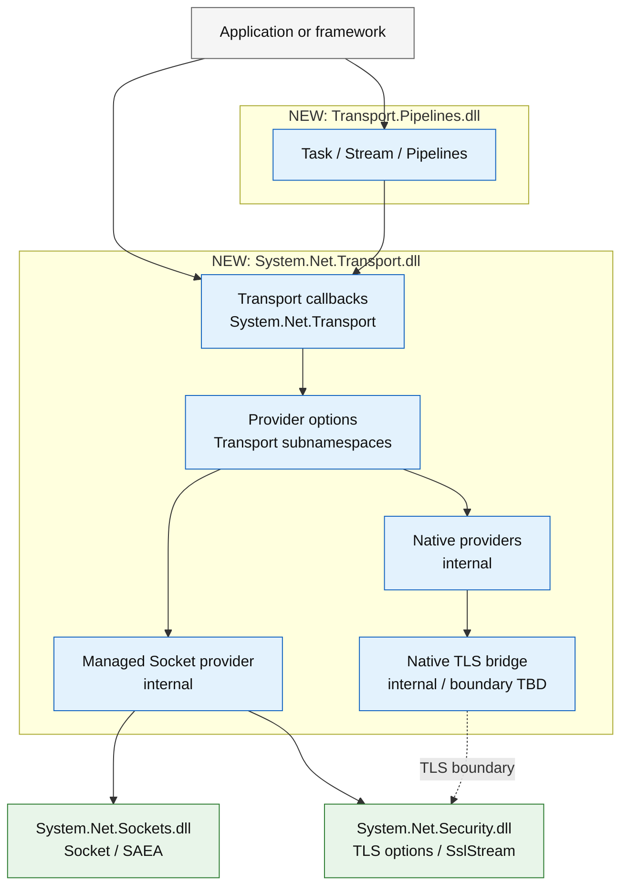
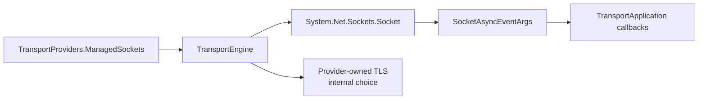

# Proposed callback-first transport API

> **Status:** Revised design candidate. The API is illustrative, experimental, unapproved, and unimplemented.
>
> **Primary change from the first draft:** the low-level data plane no longer exposes `ReadAsync`, `WriteAsync`, `AcceptAsync`, or `AuthenticateAsServerAsync`. It uses synchronous submission and provider-owned callbacks. Task-based connect, Stream, Pipelines, and Kestrel APIs are adapters above this layer.

## Decision

The core transport API should follow the useful part of SocketSet's model:

- one engine owns shared provider resources;
- `Listen` and `Connect` synchronously submit control-plane work;
- accept, connect, receive, write completion, TLS progression, and close are callbacks;
- receive buffers are borrowed only for the callback;
- a connection is stable identity, outbound writer, close control, backpressure control, and metadata;
- TLS is selected as connection policy and driven by the engine/provider, not invoked as a high-level method on the connection;
- async APIs are optional adapters.

This does **not** make the implementation synchronous. epoll, io_uring, IOCP, RIO, SAEA, OpenSSL, and Schannel still have asynchronous state, operation identities, cancellation races, and terminal completions. The difference is where that state is represented: provider-owned slots and callbacks rather than one `Task`/`ValueTask` state machine per read and write.

## Acceptance criteria for this API revision

1. The core surface contains no task-based read, write, accept, or TLS-authentication method.
2. A listener has an independent lifetime instead of being owned only by the whole engine.
3. An outbound connection attempt has a first-class correlation and cancellation handle.
4. A write submission has a first-class completion identity.
5. Close notification carries phase, reason, and exception.
6. Portable engine policy is separated from typed managed, epoll, io_uring, IOCP, and RIO provider options.
7. ClientHello observation is a callback raised by the TLS handshake state machine, not a separate consumer invocation.
8. Built-in provider implementations remain internal; consumers select them through one provider-level API.
9. The managed provider uses ordinary `System.Net.Sockets.Socket` and `SocketAsyncEventArgs` while presenting exactly the same callbacks as native providers.
10. Higher-level async and Pipelines adapters can be implemented without changing the core provider contract.

## Assembly map

Preferred API placement:

| Assembly | Responsibility |
|---|---|
| `System.Net.Transport.dll` | Core callback API, provider selection/options, and internal backend implementations |
| `System.Net.Transport.Pipelines.dll` | Optional Task, Stream, and Pipelines adapters |
| `System.Net.Sockets.dll` | Existing Socket/SAEA implementation used by the managed provider |
| `System.Net.Security.dll` | Existing TLS options, certificates, and `SslStream` |

`System.Net.Security.dll` already references `System.Net.Sockets.dll`. A new `System.Net.Transport.dll` can reference both existing assemblies without creating a dependency cycle.

The unresolved part is native TLS reuse. fd-bound OpenSSL and the Schannel token engine currently depend on internal security implementation. The preferred public placement therefore requires one deliberate follow-up:

- expose a small experimental low-level TLS engine from `System.Net.Security`; or
- refactor shared TLS implementation into a lower internal component referenced by both assemblies.

Putting the entire transport API in `System.Net.Security.dll` remains the simplest implementation option, but the assembly name and responsibility would be misleading. Duplicating TLS policy or adding framework `InternalsVisibleTo`/`UnsafeAccessor` is not acceptable.

## Layer boundaries



Diagram colors show assembly placement: blue is a new assembly, green is an existing runtime assembly, and gray is consumer code.

The core API ends at callbacks and borrowed buffers. `Task`, `Stream`, and `IDuplexPipe` ownership begins in the adapter layer.

## Proposed reference surface

### Provider selection

Built-in provider implementation classes remain internal. The public static factory gives callers typed configuration without exposing the implementation class itself.

```csharp
namespace System.Net.Transport;

[Experimental("SYSLIBXXXX", UrlFormat = "https://aka.ms/dotnet-warnings/{0}")]
public static class TransportProviders
{
    public static TransportProvider CreateDefault();

    public static TransportProvider ManagedSockets(
        Sockets.ManagedSocketTransportOptions? options = null);

    [SupportedOSPlatform("linux")]
    public static TransportProvider Epoll(
        Epoll.EpollTransportOptions? options = null);

    [SupportedOSPlatform("linux")]
    public static TransportProvider IoUring(
        IoUring.IoUringTransportOptions? options = null);

    [SupportedOSPlatform("windows")]
    public static TransportProvider WindowsIocp(
        Iocp.IocpTransportOptions? options = null);

    [SupportedOSPlatform("windows")]
    public static TransportProvider WindowsRio(
        Rio.RioTransportOptions? options = null);
}

[Experimental("SYSLIBXXXX", UrlFormat = "https://aka.ms/dotnet-warnings/{0}")]
public abstract class TransportProvider
{
    protected TransportProvider();

    public abstract string Name { get; }
    public abstract bool IsSupported { get; }

    public abstract TransportEngine CreateEngine(
        TransportEngineOptions options,
        ITransportApplication application);
}
```

`CreateDefault` probes every time it is called rather than returning one globally cached provider. Proposed default order:

1. Windows IOCP;
2. Linux io_uring when the required features are usable;
3. Linux epoll;
4. managed Socket.

RIO is never selected automatically.

### Portable engine options

These options express policy shared by every provider. They deliberately exclude ring entries, epoll event batches, IOCP completion batches, RIO queue depth, and provider buffer-registration mechanics.

```csharp
[Experimental("SYSLIBXXXX", UrlFormat = "https://aka.ms/dotnet-warnings/{0}")]
public sealed class TransportEngineOptions
{
    public TransportEngineOptions();

    public int InitialWorkerCount { get; set; }
    public int MaximumWorkerCount { get; set; }
    public int MaximumConnectionsPerWorker { get; set; } = 4096;
    public bool PinWorkerThreads { get; set; }
    public bool TrackEndpoints { get; set; } = true;
    public TimeSpan IdleTimeout { get; set; }
}
```

Semantics:

- `InitialWorkerCount == 0` lets the selected provider choose.
- `MaximumWorkerCount == 0` disables dynamic growth.
- a provider may clamp worker count to its model; the managed provider uses one logical worker;
- `MaximumConnectionsPerWorker` is a capacity policy, not a ring-entry or buffer-count setting;
- provider-resolved values are readable from the created engine.

### Typed provider options

The first draft omitted these. The revised API makes them explicit and provider-specific.

```csharp
namespace System.Net.Transport.Sockets
{
    [Experimental("SYSLIBXXXX", UrlFormat = "https://aka.ms/dotnet-warnings/{0}")]
    public sealed class ManagedSocketTransportOptions
    {
        public ManagedSocketTransportOptions();

        public int ReceiveBufferSize { get; set; } = 4096;
        public int WriteBufferSize { get; set; } = 4096;
        public int WriteBufferCount { get; set; } = 1024;
        public bool WaitForDataBeforeAllocatingBuffer { get; set; } = true;
        public bool PreferInlineCompletions { get; set; }
    }
}

namespace System.Net.Transport.Epoll
{
    [Experimental("SYSLIBXXXX", UrlFormat = "https://aka.ms/dotnet-warnings/{0}")]
    public sealed class EpollTransportOptions
    {
        public EpollTransportOptions();

        public int MaximumEventsPerWait { get; set; } = 256;
        public int ReadBurstLimit { get; set; } = 8;
        public int WriteBurstLimit { get; set; } = 16;
        public int ReceiveBufferSize { get; set; } = 4096;
        public int WriteBufferSize { get; set; } = 4096;
        public int WriteBufferCount { get; set; } = 1024;
        public bool ReusePort { get; set; } = true;
    }
}

namespace System.Net.Transport.IoUring
{
    [Experimental("SYSLIBXXXX", UrlFormat = "https://aka.ms/dotnet-warnings/{0}")]
    public sealed class IoUringTransportOptions
    {
        public IoUringTransportOptions();

        public int RingEntryCount { get; set; } = 4096;
        public int ProvidedBufferCount { get; set; } = 256;
        public int ReceiveBufferSize { get; set; } = 4096;
        public int WriteBufferSize { get; set; } = 4096;
        public int WriteBufferCount { get; set; } = 1024;
        public int OutOfBandWriteBufferCount { get; set; } = 256;
        public int MaximumBorrowedReceiveBuffers { get; set; } = 128;
        public bool ReusePort { get; set; } = true;
    }
}

namespace System.Net.Transport.Iocp
{
    [Experimental("SYSLIBXXXX", UrlFormat = "https://aka.ms/dotnet-warnings/{0}")]
    public sealed class IocpTransportOptions
    {
        public IocpTransportOptions();

        public int CompletionBatchSize { get; set; } = 128;
        public int AcceptConcurrency { get; set; } = 32;
        public int ReceiveBufferSize { get; set; } = 4096;
        public int WriteBufferSize { get; set; } = 4096;
        public int WriteBufferCount { get; set; } = 1024;
    }
}

namespace System.Net.Transport.Rio
{
    [Experimental("SYSLIBXXXX", UrlFormat = "https://aka.ms/dotnet-warnings/{0}")]
    public sealed class RioTransportOptions
    {
        public RioTransportOptions();

        public int CompletionQueueSize { get; set; } = 4096;
        public int AcceptConcurrency { get; set; } = 32;
        public int ReceiveBufferSize { get; set; } = 4096;
        public int SendBufferSize { get; set; } = 65536;
        public int RegisteredSendBufferCount { get; set; } = 256;
    }
}
```

These are candidate experimental resource knobs, not a claim that every value should stabilize. TLS implementation strategy is deliberately absent: configuring TLS has one public meaning, while fd-bound OpenSSL, memory-BIO OpenSSL, `SslStream`, Schannel, and kTLS are provider implementation decisions.

### Application callbacks

The application object is separate from the engine so one object does not simultaneously represent provider resources, listener lifetime, callbacks, and user protocol state.

```csharp
[Experimental("SYSLIBXXXX", UrlFormat = "https://aka.ms/dotnet-warnings/{0}")]
public interface ITransportApplication
{
    void OnAccepting(ref TransportAcceptingContext context);
    void OnReady(ref TransportReadyContext context);
    void OnConnectFailed(ref TransportConnectFailedContext context);
    void OnReceive(ref TransportReceiveContext context);
    void OnWriteCompleted(ref TransportWriteCompletedContext context);
    void OnClosed(ref TransportClosedContext context);
    void OnListenerClosed(ref TransportListenerClosedContext context);
    void OnWorkerFaulted(ref TransportWorkerFaultedContext context);
    void OnBatchCompleted(int workerIndex);
}

[Experimental("SYSLIBXXXX", UrlFormat = "https://aka.ms/dotnet-warnings/{0}")]
public abstract class TransportApplication : ITransportApplication
{
    protected TransportApplication();

    protected virtual void OnAccepting(
        ref TransportAcceptingContext context);

    protected virtual void OnReady(
        ref TransportReadyContext context);

    protected virtual void OnConnectFailed(
        ref TransportConnectFailedContext context);

    protected virtual void OnReceive(
        ref TransportReceiveContext context);

    protected virtual void OnWriteCompleted(
        ref TransportWriteCompletedContext context);

    protected virtual void OnClosed(
        ref TransportClosedContext context);

    protected virtual void OnListenerClosed(
        ref TransportListenerClosedContext context);

    protected virtual void OnWorkerFaulted(
        ref TransportWorkerFaultedContext context);

    protected virtual void OnBatchCompleted(
        int workerIndex);

    void ITransportApplication.OnAccepting(ref TransportAcceptingContext context);
    void ITransportApplication.OnReady(ref TransportReadyContext context);
    void ITransportApplication.OnConnectFailed(ref TransportConnectFailedContext context);
    void ITransportApplication.OnReceive(ref TransportReceiveContext context);
    void ITransportApplication.OnWriteCompleted(ref TransportWriteCompletedContext context);
    void ITransportApplication.OnClosed(ref TransportClosedContext context);
    void ITransportApplication.OnListenerClosed(ref TransportListenerClosedContext context);
    void ITransportApplication.OnWorkerFaulted(ref TransportWorkerFaultedContext context);
    void ITransportApplication.OnBatchCompleted(int workerIndex);
}
```

Providers invoke the public `ITransportApplication` contract. Most consumers derive from `TransportApplication`, which explicitly implements that interface and offers protected virtual methods so only the callbacks they need must be overridden.

Callback rules:

- callbacks for one connection are serialized on its owning provider context;
- callbacks for different connections may run concurrently;
- callback buffers are borrowed and cannot escape the callback;
- an exception from application code fails only that connection and is reported through `OnClosed`;
- `OnWorkerFaulted` is reserved for a provider-wide worker failure;
- `OnBatchCompleted` permits protocol adapters to coalesce work at provider-batch granularity.

### Engine and listener lifetime

Control-plane creation is synchronous. It may allocate native resources and start workers, and it fails before returning.

```csharp
[Experimental("SYSLIBXXXX", UrlFormat = "https://aka.ms/dotnet-warnings/{0}")]
public abstract class TransportEngine : IDisposable
{
    protected TransportEngine();

    public abstract TransportProvider Provider { get; }
    public abstract TransportEngineOptions Options { get; }
    public abstract int WorkerCount { get; }

    public abstract TransportListener Listen(
        TransportListenOptions options);

    public abstract TransportConnectOperation Connect(
        TransportConnectOptions options);

    public abstract void Dispose();
}

[Experimental("SYSLIBXXXX", UrlFormat = "https://aka.ms/dotnet-warnings/{0}")]
public sealed class TransportListenOptions
{
    public TransportListenOptions();

    public required IPEndPoint EndPoint { get; init; }
    public int Backlog { get; set; } = 512;
    public bool NoDelay { get; set; } = true;
    public object? State { get; init; }
    public TransportServerTlsOptions? Tls { get; set; }
}

[Experimental("SYSLIBXXXX", UrlFormat = "https://aka.ms/dotnet-warnings/{0}")]
public abstract class TransportListener : IDisposable
{
    protected TransportListener();

    public abstract long Id { get; }
    public abstract IPEndPoint LocalEndPoint { get; }
    public abstract object? State { get; }
    public abstract bool IsAccepting { get; }

    public abstract void Dispose();
}
```

`Listen` returns only after bind, listen, provider registration, and accept arming succeed. Disposing a listener:

- stops new accepts;
- waits for accept operations owned by that listener to reach terminal state;
- does not close connections already delivered through `OnAccepting`;
- triggers `OnListenerClosed` once.

`TransportEngine.Dispose` synchronously stops every listener, aborts remaining connections, drains provider operation state, joins provider workers, and then returns. It must not be called from a provider callback; doing so throws `InvalidOperationException`. A higher-level host can wrap blocking shutdown in its own async lifetime if needed.

### Connect submission and correlation

```csharp
[Experimental("SYSLIBXXXX", UrlFormat = "https://aka.ms/dotnet-warnings/{0}")]
public sealed class TransportConnectOptions
{
    public TransportConnectOptions();

    public required EndPoint RemoteEndPoint { get; init; }
    public IPEndPoint? LocalEndPoint { get; init; }
    public bool NoDelay { get; set; } = true;
    public int? RequiredWorkerIndex { get; init; }
    public object? State { get; init; }
    public TransportClientTlsOptions? Tls { get; set; }
}

[Experimental("SYSLIBXXXX", UrlFormat = "https://aka.ms/dotnet-warnings/{0}")]
public readonly struct TransportConnectOperation :
    IEquatable<TransportConnectOperation>
{
    public long Id { get; }
    public object? State { get; }
    public bool IsValid { get; }

    public bool Cancel();
}
```

`Connect` is a synchronous submission:

- it validates the endpoint and required worker;
- reserves provider capacity;
- creates or queues the native connect operation;
- returns a value-type operation handle.

Completion:

- success produces `OnReady` with both the operation and the ready connection;
- connect, TLS, cancellation, or provider failure before readiness produces `OnConnectFailed`;
- `Cancel` requests cancellation but the provider retains native state until its terminal completion;
- one operation callback is produced exactly once.

This fixes SocketSet's current `void Connect(...)` correlation gap without requiring a `Task` in the core.

### Pre-handshake accept and post-handshake ready phases

An accepted TCP connection is visible before TLS so frameworks can count, reject, tag, and apply handshake limits before expensive authentication.

```csharp
[Experimental("SYSLIBXXXX", UrlFormat = "https://aka.ms/dotnet-warnings/{0}")]
public ref struct TransportAcceptingContext
{
    public TransportListener Listener { get; }
    public TransportConnection Connection { get; }

    public TransportServerTlsOptions? Tls { get; set; }

    public void Reject(Exception? error = null);
}

public enum TransportConnectionOrigin
{
    Accepted = 0,
    Connected = 1,
}

[Experimental("SYSLIBXXXX", UrlFormat = "https://aka.ms/dotnet-warnings/{0}")]
public ref struct TransportReadyContext
{
    public TransportConnection Connection { get; }
    public TransportConnectionOrigin Origin { get; }
    public TransportListener? Listener { get; }
    public TransportConnectOperation ConnectOperation { get; }

    public Span<byte> GetWriteSpan(int sizeHint = 0);
    public int WriteBytes { get; set; }
}
```

Lifecycle:

1. TCP accept creates connection identity.
2. `OnAccepting` runs before TLS.
3. The callback may reject, change the preseeded TLS policy, or leave it plaintext.
4. If TLS is selected, the provider drives the handshake and its registered ClientHello/options callbacks.
5. `OnReady` runs only after plaintext selection or successful TLS authentication.
6. `OnReceive` begins only after `OnReady` returns.

For outbound connections, `OnReady` is raised after TCP connect and any configured TLS handshake.

### Connection API

The connection has no read method. Receive belongs to the provider and is delivered through `OnReceive`.

```csharp
[Experimental("SYSLIBXXXX", UrlFormat = "https://aka.ms/dotnet-warnings/{0}")]
public abstract class TransportConnection : IBufferWriter<byte>
{
    protected TransportConnection();

    public abstract long Id { get; }
    public abstract object? State { get; set; }
    public abstract IPEndPoint? LocalEndPoint { get; }
    public abstract IPEndPoint? RemoteEndPoint { get; }
    public abstract TransportConnectionOrigin Origin { get; }
    public abstract TransportTlsInfo? TlsInfo { get; }

    public abstract bool SupportsReceivePause { get; }
    public abstract bool TryPauseReceive();
    public abstract void ResumeReceive();

    public abstract Span<byte> GetSpan(int sizeHint = 0);
    public abstract Memory<byte> GetMemory(int sizeHint = 0);
    public abstract void Advance(int count);

    public abstract TransportWriteOperation Flush(
        object? state = null);

    public virtual TransportWriteOperation Send(
        ReadOnlySpan<byte> data,
        object? state = null);

    public virtual TransportWriteOperation Send(
        in ReadOnlySequence<byte> data,
        object? state = null);

    public abstract void ShutdownRead();
    public abstract void ShutdownWrite();
    public abstract void Abort(Exception? error = null);
}

[Experimental("SYSLIBXXXX", UrlFormat = "https://aka.ms/dotnet-warnings/{0}")]
public readonly struct TransportWriteOperation :
    IEquatable<TransportWriteOperation>
{
    public long Id { get; }
    public object? State { get; }
    public bool IsValid { get; }
}
```

Write contract:

- `GetSpan`/`GetMemory` return provider-owned outbound memory;
- `Advance` commits bytes to the current composition;
- `Flush` submits one logical write and returns its correlation handle;
- `Send` copies into provider-owned memory and flushes;
- writes are ordered;
- `OnWriteCompleted` fires once per logical flush after all partial native writes complete;
- the callback carries success or failure and the original operation/state;
- only one application writer may compose bytes at a time;
- providers may queue multiple completed compositions, but they retain ownership and ordering.

This avoids exposing a task while still giving an async adapter enough identity to complete the correct waiter.

### Receive and write callbacks

```csharp
[Experimental("SYSLIBXXXX", UrlFormat = "https://aka.ms/dotnet-warnings/{0}")]
public ref struct TransportReceiveContext
{
    public TransportConnection Connection { get; }
    public ReadOnlySpan<byte> Payload { get; }
    public bool IsCompleted { get; }

    public Span<byte> GetResponseSpan(int sizeHint = 0);
    public int ResponseBytes { get; set; }
    public void StopReceiving();
}

[Experimental("SYSLIBXXXX", UrlFormat = "https://aka.ms/dotnet-warnings/{0}")]
public ref struct TransportWriteCompletedContext
{
    public TransportConnection Connection { get; }
    public TransportWriteOperation Operation { get; }
    public Exception? Error { get; }

    public Span<byte> GetWriteSpan(int sizeHint = 0);
    public int WriteBytes { get; set; }
}
```

Receive contract:

- `Payload` is borrowed for the callback and cannot be retained;
- `IsCompleted` means no later receive callback will carry payload;
- writing an immediate response into `GetResponseSpan` avoids an additional composition step;
- `ResponseBytes` may not exceed the returned span;
- no public unwiped-buffer escape hatch is proposed;
- slow-consumer adapters call `TryPauseReceive` and later `ResumeReceive`;
- provider-specific already-completed receive work remains bounded by provider options.

### Close and failure callbacks

```csharp
public enum TransportConnectionPhase
{
    Connecting = 0,
    Accepting = 1,
    Handshaking = 2,
    Ready = 3,
    Closing = 4,
}

public enum TransportCloseReason
{
    LocalShutdown = 0,
    LocalAbort = 1,
    PeerClosed = 2,
    PeerReset = 3,
    ConnectFailed = 4,
    TlsHandshakeFailed = 5,
    Timeout = 6,
    ProviderStopped = 7,
    Error = 8,
}

[Experimental("SYSLIBXXXX", UrlFormat = "https://aka.ms/dotnet-warnings/{0}")]
public readonly ref struct TransportConnectFailedContext
{
    public TransportConnectOperation Operation { get; }
    public Exception Error { get; }
}

[Experimental("SYSLIBXXXX", UrlFormat = "https://aka.ms/dotnet-warnings/{0}")]
public readonly ref struct TransportClosedContext
{
    public TransportConnection Connection { get; }
    public TransportConnectionPhase Phase { get; }
    public TransportCloseReason Reason { get; }
    public Exception? Error { get; }
}

[Experimental("SYSLIBXXXX", UrlFormat = "https://aka.ms/dotnet-warnings/{0}")]
public readonly ref struct TransportListenerClosedContext
{
    public TransportListener Listener { get; }
    public Exception? Error { get; }
}

[Experimental("SYSLIBXXXX", UrlFormat = "https://aka.ms/dotnet-warnings/{0}")]
public readonly ref struct TransportWorkerFaultedContext
{
    public int WorkerIndex { get; }
    public Exception Error { get; }
}
```

Unlike SocketSet's `OnClosed(Connection)`, this preserves the terminal reason. A connection that reached `OnAccepting` always reaches `OnClosed`, even when TLS fails before `OnReady`. A failed outbound attempt that never created application-visible connection identity reaches `OnConnectFailed`.

### Worker affinity

```csharp
[Experimental("SYSLIBXXXX", UrlFormat = "https://aka.ms/dotnet-warnings/{0}")]
public static class TransportExecutionContext
{
    public static int CurrentWorkerIndex { get; }
}
```

`CurrentWorkerIndex` is `-1` outside a provider-owned callback or for a callback-driven provider that cannot expose stable worker affinity. `TransportConnectOptions.RequiredWorkerIndex` permits proxy implementations to place an outbound connection on the current native worker. A provider that cannot honor an explicit required worker fails the connect submission rather than silently changing placement.

## TLS configuration is callback-driven

The connection has no `AuthenticateAsServerAsync` or `AuthenticateAsClientAsync`.

TLS is configured on the listener, connect options, or `OnAccepting` context. The engine drives the handshake before `OnReady`.

When TLS is configured:

- the provider owns the socket from accept/connect through handshake and application I/O;
- application callbacks never receive arbitrary raw TCP ciphertext;
- `ClientHelloCallback` is the supported early observation point;
- `OnReady` and `OnReceive` expose only authenticated plaintext;
- no `UseHttps`-style middleware insertion contract is required.

Condensed transport-facing configuration:

```csharp
[Experimental("SYSLIBXXXX", UrlFormat = "https://aka.ms/dotnet-warnings/{0}")]
public sealed class TransportClientTlsOptions
{
    public TransportClientTlsOptions();

    public required SslClientAuthenticationOptions AuthenticationOptions { get; init; }
    public TransportTlsOffloadOptions Offload { get; init; } = new();
}

[Experimental("SYSLIBXXXX", UrlFormat = "https://aka.ms/dotnet-warnings/{0}")]
public sealed class TransportServerTlsOptions
{
    public TransportServerTlsOptions();

    public required SslServerAuthenticationOptions AuthenticationOptions { get; init; }
    public TransportClientHelloCallback? ClientHelloCallback { get; init; }
    public TransportServerOptionsSelectionCallback? OptionsSelectionCallback { get; init; }
    public TimeSpan ClientHelloTimeout { get; set; } = TimeSpan.FromSeconds(8);
    public TimeSpan HandshakeTimeout { get; set; } = TimeSpan.FromSeconds(10);
    public bool AllowPostHandshakeClientAuthentication { get; init; }
    public TransportTlsOffloadOptions Offload { get; init; } = new();
}

public delegate void TransportClientHelloCallback(
    ref TransportClientHelloContext context);

public delegate ValueTask<SslServerAuthenticationOptions>
    TransportServerOptionsSelectionCallback(
        TransportServerOptionsSelectionContext context,
        CancellationToken cancellationToken);

public readonly ref struct TransportClientHelloContext
{
    public TransportConnection Connection { get; }
    public SslClientHelloInfo ClientHelloInfo { get; }
    public ReadOnlySequence<byte> FirstRecordBytes { get; }
    public bool ContainsCompleteClientHello { get; }
}

public sealed class TransportServerOptionsSelectionContext
{
    internal TransportServerOptionsSelectionContext();

    public TransportConnection Connection { get; }
    public SslClientHelloInfo ClientHelloInfo { get; }
    public SslServerAuthenticationOptions DefaultOptions { get; }
}
```

The raw ClientHello callback is synchronous and executes inside the handshake state transition. It is suitable for JA4 input capture and other bounded observation. The async options callback may suspend the handshake for certificate or policy selection.

`ClientHelloTimeout` bounds reaching and completing the raw callback phase. `HandshakeTimeout` bounds the remaining handshake, including async option selection. This preserves Kestrel's two timeout phases without a separate public `ObserveTlsClientHelloAsync` operation.

For fd-bound OpenSSL:

1. `SSL_do_handshake` reads through the nonblocking socket BIO.
2. OpenSSL's ClientHello callback runs after parsing the ClientHello.
3. the runtime invokes `ClientHelloCallback`;
4. if async option selection is required, the TLS engine suspends and returns a retry state;
5. the provider changes epoll/poll interest according to the TLS operation result and resumes the same handshake later.

No memory BIO or raw socket peek is required for the ClientHello callback.

The exact internal OpenSSL/Schannel TLS-session API is not proposed as public transport API here. Built-in providers choose their implementation internally. If third-party providers need the same native TLS engine, that lower-level security API requires a separate public API review.

## How the managed Socket provider fits

The managed provider is not a wrapper above a different connection model. It is one implementation of the same callback engine.



Mapping:

| Core operation | Managed implementation |
|---|---|
| `Listen` | Create/bind/listen ordinary `Socket`; arm `Socket.AcceptAsync(SocketAsyncEventArgs)` |
| `Connect` | Create ordinary `Socket`; use SAEA connect completion; map the returned operation handle to that SAEA |
| receive callback | One SAEA receive buffer per connection; invoke `OnReceive` from completion processing |
| write composition | Provider-owned pooled arrays or pinned memory behind `IBufferWriter<byte>` |
| write completion | One logical operation tracked across partial `Socket.SendAsync` completions, then `OnWriteCompleted` |
| receive pause | Do not arm the next SAEA receive |
| abort | Dispose the Socket, retain SAEA state until callbacks are terminal |
| TLS | Use the same listener/connect TLS configuration and callbacks; implementation may choose the exact `SslStream` compatibility path or the runtime's internal OpenSSL/Schannel transform |
| worker affinity | `CurrentWorkerIndex == -1`; explicit required-worker connect is rejected |

This is the same consumer API as epoll, io_uring, IOCP, and RIO. The managed provider is therefore a compatibility provider and the benchmark control, not an adapter pretending to be a native engine.

## How provider-specific use differs

Consumer protocol and TLS code does not change. Only provider creation and provider resource options change.

```csharp
TransportProvider provider = TransportProviders.IoUring(
    new IoUringTransportOptions
    {
        RingEntryCount = 4096,
        ProvidedBufferCount = 512,
        ReceiveBufferSize = 4096,
        WriteBufferSize = 16384,
    });

using TransportEngine engine = provider.CreateEngine(
    new TransportEngineOptions
    {
        InitialWorkerCount = Environment.ProcessorCount,
        MaximumConnectionsPerWorker = 4096,
        PinWorkerThreads = true,
    },
    application);

using TransportListener listener = engine.Listen(
    new TransportListenOptions
    {
        EndPoint = new IPEndPoint(IPAddress.Any, 8443),
        Tls = serverTls,
    });
```

Changing `IoUring` to `Epoll`, `WindowsIocp`, `WindowsRio`, or `ManagedSockets` changes provider construction and valid provider options, not connection callback code.

## Provider-specific usage examples

Compilable illustrative usage files are under [`examples`](examples/README.md):

- [`ManagedSocketsPlaintext.cs`](examples/ManagedSocketsPlaintext.cs)
- [`ManagedSocketsTls.cs`](examples/ManagedSocketsTls.cs)
- [`EpollPlaintext.cs`](examples/EpollPlaintext.cs)
- [`EpollTls.cs`](examples/EpollTls.cs)
- [`IoUringPlaintext.cs`](examples/IoUringPlaintext.cs)
- [`IoUringTls.cs`](examples/IoUringTls.cs)
- [`WindowsIocpTls.cs`](examples/WindowsIocpTls.cs)
- [`WindowsRioTls.cs`](examples/WindowsRioTls.cs)

Each file shows:

- provider selection;
- provider-specific options;
- engine and listener lifetime;
- the same callback-based read/write application;
- TLS configuration and when the handshake completes;
- important limitations of that provider.

## Higher-level async adapters

The core does not reject async programming. It moves async to adapters that have a reason to allocate and correlate tasks.

Examples:

- a client adapter stores a `TaskCompletionSource` keyed by `TransportConnectOperation.Id` and completes it from `OnReady` or `OnConnectFailed`;
- a write adapter stores a waiter keyed by `TransportWriteOperation.Id` and completes it from `OnWriteCompleted`;
- a Pipelines adapter copies or adopts `OnReceive` data and pauses receiving when `FlushAsync` applies backpressure;
- a Stream adapter serializes one read waiter and one write waiter;
- Kestrel implements `IConnectionListener.AcceptAsync` over the listener callbacks.

These adapters can offer cancellation tokens because they own the waiter and can call the core operation's cancellation or abort mechanism. The core provider still retains native state until terminal completion.

The adapter API should be designed after the callback core has a working managed implementation. It is intentionally not included in the reference surface above.

## How this fixes the SocketSet issues

| SocketSet issue | Revised design |
|---|---|
| Portable and backend options share one bag | `TransportEngineOptions` contains only shared policy; each built-in provider has a typed options class |
| Whole engine owns all listeners with no listener object | `TransportEngine.Listen` returns an independently disposable `TransportListener` |
| `void Connect` has weak failure correlation | `TransportConnectOperation` identifies and cancels one attempt; completion callbacks carry it |
| `OnClosed(Connection)` loses the error | `TransportClosedContext` carries phase, reason, and exception |
| Public factory/shard/connection SPI exposes many mechanics | Built-in provider classes and native operation types stay internal; the public SPI is provider -> engine -> connection plus callback contexts |
| TLS provider SPI diverges from built-in fd-bound path | Built-in TLS integration remains inside the owning runtime assembly; no claim is made that the initial public transport SPI exposes every TLS implementation hook |
| Server TLS selection callback cannot see ClientHello | Raw and async option callbacks are raised from the handshake after ClientHello parsing |
| Unwiped buffer escape hatches are public | The proposed callback buffer API has no unwiped variant |
| Construction hides threads/native setup inside a subclass constructor | Provider creation is cheap; `CreateEngine` is the explicit synchronous resource-creation boundary |
| Cached global `Default` fixes one probe result for process lifetime | `TransportProviders.CreateDefault()` probes per call and the created engine reports the selected provider |
| Adapter-specific options partially duplicate engine options | Adapter options own only bridge/scheduler behavior; provider and engine options remain provider/engine objects |

## Open questions

1. Should provider creation use static factory methods as shown, or public concrete provider classes?
2. Is synchronous blocking `TransportEngine.Dispose` acceptable, or should the core expose `Stop` plus a callback when workers are drained?
3. Should `TransportWriteOperation` support cancellation, given that cancellation after a partial stream write generally requires aborting the connection?
4. Is `RequiredWorkerIndex` too implementation-specific, or is it justified by proxy affinity?
5. Should immediate response buffers be retained in the BCL surface, or should `OnReceive` only expose payload and require `Connection.Send`?
6. Which provider options have a real user scenario versus being benchmark-only implementation knobs?
7. Does the first public SPI support third-party providers, or only built-in provider selection while the SPI incubates internally?
8. What internal or public TLS boundary lets a separate `System.Net.Transport.dll` reuse runtime TLS implementation without exposing provider strategy to consumers?

## API evolution rule

The managed provider should be implemented first because it can prove callback semantics, listener/connect correlation, close reasons, TLS policy integration, and adapters without requiring a new native backend. epoll and IOCP then prove one readiness and one completion provider. io_uring and RIO should follow only after the provider-specific options and buffer lifetimes are tested.

No stable public surface should be proposed until:

- the managed provider runs a real Kestrel adapter and a long-lived multiplexed client;
- epoll and IOCP implement the same callbacks;
- the async/Pipelines adapters need no provider-specific public escape hatch;
- ClientHello and all required Kestrel TLS callbacks work without a separate handshake method;
- provider options report what was actually applied;
- measurements identify which low-level mechanisms justify public exposure rather than internal Socket improvements.
