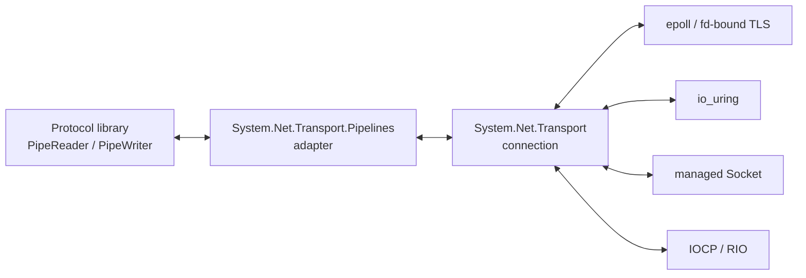

# System.Net.Transport.Pipelines proposal

> **Status:** Design proposal. The API names and signatures are illustrative, experimental, unapproved, and unimplemented.
>
> **Assembly:** `System.Net.Transport.Pipelines.dll`
>
> **Scope:** Adapt one `System.Net.Transport.TransportConnection` to `System.IO.Pipelines.IDuplexPipe` without exposing sockets, native handles, provider workers, io_uring buffer IDs, OpenSSL sessions, or ASP.NET Core types.

## General idea

The adapter separates transport I/O from protocol and application execution while avoiding an unnecessary copy when a provider can safely share its receive storage with Pipelines.

Kestrel and other protocol libraries continue to consume:

```csharp
PipeReader input;
PipeWriter output;
```

They do not call `OnReceive`, manage `TransportReceiveLease`, understand epoll readiness, or wait for io_uring CQEs. The adapter owns those details.

The inbound flow has three possible implementations behind the same `PipeReader`:

1. **Direct destination:** a readiness-based provider asks the adapter for writable pipe memory and performs `recv` or `SSL_read` directly into it.
2. **Retained provider buffer:** a completion-based provider receives into its own storage, gives the adapter a `TransportReceiveLease`, and the adapter exposes that storage as a readable pipe segment until the consumer advances past it.
3. **Copy fallback:** the adapter copies `OnReceive.Payload` into an ordinary pipe block when neither direct destination nor retention is available.



The adapter chooses the best available path per connection:

```text
epoll or managed Socket:
    writable pipe memory
        -> recv / SSL_read writes directly into it
        -> PipeReader exposes the same memory

io_uring multishot:
    kernel selects provider buffer
        -> adapter retains that filled buffer
        -> PipeReader exposes the same memory
        -> AdvanceTo releases the retained buffer

fallback:
    provider callback buffer
        -> copy into pipe-owned memory
        -> PipeReader exposes the copy
```

Pipelines isolate the layers through API, scheduling, ownership, consumption positions, and backpressure. Isolation does not require copying the bytes.

The adapter has two independent directions:

```text
Inbound:
    provider -> adapter -> PipeReader -> protocol

Outbound:
    protocol -> PipeWriter -> adapter -> provider
```

The inbound adapter schedules protocol continuations using the configured application scheduler. The outbound adapter schedules transport work using the configured transport scheduler. Provider callbacks do not execute arbitrary protocol or application logic inline.

## Goals

- Present the same `IDuplexPipe` contract for managed Socket, epoll, io_uring, IOCP, and RIO providers.
- Preserve direction-specific `PipeScheduler`, `MemoryPool<byte>`, pause threshold, and resume threshold configuration.
- Avoid an additional plaintext copy when a provider can receive directly into pipe memory or retain provider-selected memory.
- Preserve a correct copying fallback for every provider.
- Map pipe consumption to receive-buffer release.
- Map output-pipe consumption to terminal transport write completion.
- Apply bounded receive backpressure without blocking a provider worker.
- Keep Task allocation and asynchronous waiter state in the adapter rather than the low-level callback core.
- Keep ASP.NET Core `ConnectionContext` and feature mapping outside this assembly.

## Non-goals

- HTTP parsing, request scheduling, middleware execution, or application dispatch.
- ASP.NET Core connection features or Kestrel-specific option types.
- Exposing provider buffer IDs, file descriptors, native addresses, TLS handles, or completion records.
- Guaranteeing that every provider avoids every internal copy.
- Replacing `Pipe`, `PipeReader`, `PipeWriter`, or `IDuplexPipe`.
- Making one receive-memory strategy mandatory for every provider.
- Allowing arbitrary concurrent writers or multiple concurrent reads on one connection.

## Layering

```text
Application or protocol library
    HTTP, Redis, Orleans, proxy, database protocol
                         |
                         v
System.IO.Pipelines
    PipeReader, PipeWriter, IDuplexPipe
                         |
                         v
System.Net.Transport.Pipelines
    async listener/connect wrappers
    receive memory bridge
    send pump
    schedulers and backpressure
                         |
                         v
System.Net.Transport
    listener, connection, TLS lifecycle
    provider callbacks and terminal completion
                         |
                         v
Provider implementation
    Socket, epoll, io_uring, IOCP, RIO
```

`System.Net.Transport.Pipelines.dll` references `System.Net.Transport.dll` and `System.IO.Pipelines`. It does not reference ASP.NET Core.

ASP.NET Core can add a separate adapter which wraps `TransportPipeConnection` in `ConnectionContext` and maps TLS, endpoint, abort, close, metrics, and scheduler configuration to existing Kestrel contracts.

## Proposed public API

### Adapter options

```csharp
namespace System.Net.Transport.Pipelines;

[Experimental("SYSLIBXXXX", UrlFormat = "https://aka.ms/dotnet-warnings/{0}")]
public sealed class TransportPipelinesOptions
{
    public TransportPipelinesOptions();

    public PipeOptions InputOptions { get; set; }
    public PipeOptions OutputOptions { get; set; }
    public int MinimumReceiveSize { get; set; } = 4096;
}
```

`InputOptions` configure bytes moving from the transport to the protocol:

- the reader scheduler resumes protocol code;
- the writer scheduler runs adapter-side input work;
- pause and resume thresholds bound unconsumed input;
- the memory pool supplies blocks for direct receives and copy fallback.

`OutputOptions` configure bytes moving from the protocol to the transport:

- the writer scheduler resumes protocol code producing output;
- the reader scheduler runs the adapter send pump;
- pause and resume thresholds bound unsent output;
- the memory pool owns output blocks until terminal transport completion.

The adapter selects direct destination, retained-buffer, or copying behavior automatically. A public mode switch is not proposed because callers need consistent semantics, not provider-specific fast-path selection. Diagnostics should report which paths are actually used.

### Engine wrapper

```csharp
namespace System.Net.Transport.Pipelines;

[Experimental("SYSLIBXXXX", UrlFormat = "https://aka.ms/dotnet-warnings/{0}")]
public sealed class TransportPipeEngine : IAsyncDisposable
{
    public static TransportPipeEngine Create(
        TransportProvider provider,
        TransportEngineOptions engineOptions,
        TransportPipelinesOptions? pipelinesOptions = null);

    public TransportProvider Provider { get; }
    public int WorkerCount { get; }

    public TransportPipeListener Listen(
        TransportListenOptions options);

    public ValueTask<TransportPipeConnection> ConnectAsync(
        TransportConnectOptions options,
        CancellationToken cancellationToken = default);

    public ValueTask DisposeAsync();
}
```

`Create` constructs the internal `TransportApplication`, creates the low-level `TransportEngine`, and owns their shared lifetime.

`ConnectAsync` correlates `TransportConnectOperation` with `OnReady` or `OnConnectFailed`. Cancellation requests cancellation of the connect operation. Native resources remain owned by the provider until terminal completion even if the caller stops waiting.

### Listener wrapper

```csharp
namespace System.Net.Transport.Pipelines;

[Experimental("SYSLIBXXXX", UrlFormat = "https://aka.ms/dotnet-warnings/{0}")]
public sealed class TransportPipeListener : IAsyncDisposable
{
    public EndPoint? LocalEndPoint { get; }

    public ValueTask<TransportPipeConnection?> AcceptAsync(
        CancellationToken cancellationToken = default);

    public ValueTask DisposeAsync();
}
```

`AcceptAsync` returns `null` after normal listener shutdown. Accepted connections are queued in a bounded adapter queue. If the consumer does not accept fast enough, the adapter stops or rejects additional accepts according to listener policy rather than growing without limit.

### Pipe connection

```csharp
namespace System.Net.Transport.Pipelines;

[Experimental("SYSLIBXXXX", UrlFormat = "https://aka.ms/dotnet-warnings/{0}")]
public sealed class TransportPipeConnection :
    IDuplexPipe,
    IAsyncDisposable
{
    public long Id { get; }
    public PipeReader Input { get; }
    public PipeWriter Output { get; }
    public EndPoint? LocalEndPoint { get; }
    public EndPoint? RemoteEndPoint { get; }
    public TransportConnectionOrigin Origin { get; }
    public TransportTlsInfo? TlsInfo { get; }
    public Task Completion { get; }

    public void Abort(Exception? error = null);

    public ValueTask CloseAsync(
        CancellationToken cancellationToken = default);

    public ValueTask DisposeAsync();
}
```

`Input` carries plaintext received from the peer. If TLS is configured, no ciphertext is exposed after readiness.

`Output` carries plaintext to the peer. The adapter does not advance its internal output reader past submitted memory until `OnWriteCompleted` proves that the provider and operating system no longer reference the borrowed sequence.

`CloseAsync` completes output, drains already-produced bytes, performs TLS close notification when applicable, shuts down the write direction, and waits for terminal connection close. Its cancellation token cancels the wait; it does not make partially transmitted stream bytes replayable.

`Abort` fails both pipe directions and aborts the underlying connection.

`DisposeAsync` calls `CloseAsync` when graceful close is still possible and otherwise performs terminal cleanup. Exact graceful-versus-abort behavior needs validation against existing `ConnectionContext` and Pipelines conventions before stabilization.

## Optional direct-receive SPI

The callback and retained-lease API is sufficient for a universal adapter, but it cannot express the optimal readiness-based path:

```text
PipeWriter.GetMemory
    -> recv or SSL_read directly into that memory
    -> PipeWriter.Advance
```

By the time `OnReceive` runs, the provider has already selected and filled a different buffer. A separate receive-destination SPI is therefore required if `System.Net.Transport.Pipelines.dll` is to request direct destination memory without provider-specific types or cross-assembly private access.

Candidate addition to `System.Net.Transport.dll`:

```csharp
namespace System.Net.Transport;

[Experimental("SYSLIBXXXX", UrlFormat = "https://aka.ms/dotnet-warnings/{0}")]
public abstract class TransportReceiveSink
{
    protected TransportReceiveSink();

    public abstract Memory<byte> GetMemory(
        int sizeHint = 0);

    public abstract TransportReceiveSinkResult Commit(
        int bytesWritten);

    public abstract void Complete(
        Exception? error = null);
}

[Experimental("SYSLIBXXXX", UrlFormat = "https://aka.ms/dotnet-warnings/{0}")]
public enum TransportReceiveSinkResult
{
    Continue = 0,
    Pause = 1,
    Stop = 2,
}
```

Candidate addition to `TransportConnection`:

```csharp
public abstract bool TryAttachReceiveSink(
    TransportReceiveSink sink);
```

Attachment rules:

- the adapter calls `TryAttachReceiveSink` during `OnReady`, before receive delivery begins;
- successful attachment replaces `OnReceive` delivery for that connection;
- only one receive sink may be attached;
- the provider serializes sink calls with other callbacks for the connection;
- one `GetMemory` reservation may be outstanding at a time;
- the memory remains reserved until `Commit` or terminal `Complete`;
- the provider may synchronously invoke `recv`, `SSL_read`, or start an asynchronous receive against that memory;
- the provider does not retain a native pointer after the corresponding native operation returns or completes;
- `Commit(bytesWritten)` makes exactly those bytes readable and returns whether provider reads should continue, pause, or stop;
- `Complete(error)` terminates input and releases an uncommitted reservation;
- after successful attachment, failure to obtain valid destination memory fails the connection explicitly;
- attachment failure leaves normal `OnReceive` delivery active.

The adapter implements `Commit` by advancing its input writer or custom input buffer, starting a flush, and applying backpressure:

```csharp
internal sealed class PipeReceiveSink : TransportReceiveSink
{
    private readonly PipeWriter _writer;
    private readonly TransportConnection _connection;

    public override Memory<byte> GetMemory(int sizeHint = 0)
    {
        return _writer.GetMemory(sizeHint);
    }

    public override TransportReceiveSinkResult Commit(int bytesWritten)
    {
        _writer.Advance(bytesWritten);

        ValueTask<FlushResult> flush = _writer.FlushAsync();
        if (flush.IsCompletedSuccessfully)
        {
            FlushResult result = flush.Result;
            return result.IsCompleted || result.IsCanceled
                ? TransportReceiveSinkResult.Stop
                : TransportReceiveSinkResult.Continue;
        }

        _ = ResumeAfterFlushAsync(flush);
        return TransportReceiveSinkResult.Pause;
    }

    public override void Complete(Exception? error = null)
    {
        _writer.Complete(error);
    }

    private async Task ResumeAfterFlushAsync(
        ValueTask<FlushResult> flush)
    {
        try
        {
            FlushResult result = await flush.ConfigureAwait(false);

            if (result.IsCompleted || result.IsCanceled)
            {
                _connection.ShutdownRead();
                return;
            }

            _connection.ResumeReceive();
        }
        catch (Exception exception)
        {
            _connection.Abort(exception);
        }
    }
}
```

This is illustrative. The actual implementation must avoid racing a synchronously completed flush with pause application, and it must preserve the configured schedulers.

### Why the sink is separate from `OnReceive`

The two contracts represent opposite ordering:

```text
TransportReceiveSink:
    adapter chooses destination
        -> provider fills destination

OnReceive:
    provider chooses destination
        -> adapter receives completed data
```

Readiness-based providers can often use the first form efficiently. Completion-selected providers naturally use the second.

The sink does not belong on ordinary application implementations. It exists for attached infrastructure adapters such as `System.Net.Transport.Pipelines`.

## Inbound implementation paths

### epoll plaintext

On readable readiness:

```csharp
Memory<byte> destination =
    sink.GetMemory(minimumReceiveSize);

int bytesRead = recv(
    fileDescriptor,
    destination.Span);

if (bytesRead > 0)
{
    TransportReceiveSinkResult result =
        sink.Commit(bytesRead);

    ApplyReceiveResult(result);
}
else if (bytesRead == 0)
{
    sink.Complete();
}
else if (errno != EAGAIN)
{
    sink.Complete(CreateSocketException(errno));
}
```

`recv` writes directly into memory which the input pipe will expose to its reader.

### epoll with fd-bound OpenSSL

The provider obtains destination memory before invoking `SSL_read`:

```csharp
Memory<byte> destination =
    sink.GetMemory(minimumReceiveSize);

TlsOperationStatus status =
    tlsSession.Read(
        destination.Span,
        out int bytesRead);
```

Result handling:

```text
Complete with bytes:
    sink.Commit(bytesRead)

WANT_READ:
    preserve the destination reservation
    wait for EPOLLIN
    retry SSL_read against the same reservation

WANT_WRITE:
    preserve the destination reservation
    wait for EPOLLOUT
    retry SSL_read against the same reservation

TLS close:
    sink.Complete()

Fatal TLS or socket status:
    sink.Complete(error)
    abort connection
```

The `Memory<byte>` must remain reserved while the TLS read is pending. The provider does not need to pin it continuously while waiting for epoll because OpenSSL retains no destination pointer after `SSL_read` returns. It pins or otherwise stabilizes the memory only for each synchronous native call.

The provider must serialize `SSL_read`, `SSL_write`, handshake, shutdown, and cancellation transitions for one TLS session. Epoll interest is the union of what the read and write operations need because a read can require write readiness and a write can require read readiness.

After a successful read, the provider may perform a bounded drain of plaintext which OpenSSL already has buffered. It asks the sink for another destination after each commit and stops at a fairness limit, sink pause, TLS retry state, or EOF.

### managed Socket

If the returned memory is supported by `Socket.ReceiveAsync`, the managed provider can issue the receive directly against sink memory:

```csharp
Memory<byte> destination =
    sink.GetMemory(minimumReceiveSize);

int bytesRead =
    await socket.ReceiveAsync(
        destination,
        SocketFlags.None,
        cancellationToken);

sink.Commit(bytesRead);
```

The provider holds the one outstanding sink reservation until the asynchronous receive completes. Cancellation does not release the reservation until the socket operation reaches terminal completion.

### io_uring multishot

Multishot receive with provided buffers cannot generally use a destination chosen after completion. The kernel selected and filled a provider buffer before the adapter was notified.

The normal path is therefore:

```text
kernel fills provided buffer A
    -> OnReceive exposes A
    -> adapter calls TryRetainPayload
    -> custom input reader stores lease A
    -> PipeReader exposes A
    -> consumer AdvanceTo passes A
    -> adapter disposes lease A
```

The pipe connection still presents the same `PipeReader`. Only its internal segment ownership differs.

If retention is unavailable or its bound is exhausted, the adapter copies `OnReceive.Payload` into pipe-owned memory. It pauses receives when unconsumed bytes exceed the configured input threshold.

### IOCP and RIO

An IOCP provider can attempt direct receive into stable sink memory when that memory can remain valid for the complete OVERLAPPED lifetime. Otherwise it receives into provider-owned memory and offers retention or copying.

RIO normally requires registered memory. A provider can expose a retained registered region to the adapter, or copy into pipe memory when registration and pipe ownership cannot be reconciled.

The adapter API does not claim that every provider uses the same path.

## Retained input reader

An ordinary `PipeWriter` cannot adopt arbitrary completed read-only memory. The io_uring retention path therefore needs an adapter-owned `PipeReader` implementation or equivalent internal sequence queue.

Each queued segment contains:

```text
read-only memory
    + logical start/end positions
    + TransportReceiveLease owner
```

When the protocol calls:

```csharp
ReadResult result =
    await connection.Input.ReadAsync();
```

the returned `ReadOnlySequence<byte>` references the queued retained segments.

When the protocol calls:

```csharp
connection.Input.AdvanceTo(
    consumed,
    examined);
```

the adapter:

1. removes every segment completely before `consumed`;
2. disposes the lease associated with each removed segment;
3. preserves a partially consumed segment;
4. reduces retained-byte accounting;
5. resumes provider reads after crossing the configured resume threshold.

The lease is not disposed when `OnReceive` returns. It is disposed only when no pipe-visible byte references its storage.

Example with two receives:

```text
Receive A:
    "GET /hello HTTP/1.1\r\nHost: exam"

Receive B:
    "ple.com\r\n\r\n"

PipeReader result:
    segment A -> lease A
    segment B -> lease B

AdvanceTo(position in B):
    lease A can be disposed
    lease B remains while any unconsumed byte in B is visible
```

Protocol and application code never handles `TransportReceiveLease` directly. It observes normal `PipeReader` lifetime rules.

## Outbound send pump

The adapter owns one output read loop:

```csharp
private async Task ProcessSendsAsync()
{
    while (true)
    {
        ReadResult result =
            await _output.Reader.ReadAsync();

        ReadOnlySequence<byte> buffer =
            result.Buffer;

        if (!buffer.IsEmpty)
        {
            PendingPipeSend pending =
                new(_output.Reader, buffer.End);

            _transport.SendBorrowed(
                buffer,
                state: pending);

            await pending.Completion.ConfigureAwait(false);
        }

        _output.Reader.AdvanceTo(buffer.End);

        if (result.IsCompleted)
        {
            _transport.ShutdownWrite();
            break;
        }
    }
}
```

The adapter must not call `AdvanceTo` past a submitted sequence before terminal `OnWriteCompleted`, since advancing permits the output pipe to recycle its memory.

Completion handling:

```csharp
protected override void OnWriteCompleted(
    ref TransportWriteCompletedContext context)
{
    PendingPipeSend pending =
        (PendingPipeSend)context.Operation.State!;

    pending.Complete(context.Error);
}
```

`OnWriteCompleted` means:

- all partial native sends for the logical operation are finished;
- the provider no longer accesses the borrowed sequence;
- any zero-copy ownership notification has completed;
- the adapter may advance the output reader and allow memory reuse.

The first implementation can permit only one submitted pipe sequence at a time. A later implementation may pipeline multiple logical sends if it retains an ordered queue of sequence positions and advances the output reader only across the completed prefix.

## Scheduling

The adapter preserves four scheduling roles represented by two `PipeOptions` values:

| Direction | Role | Typical Kestrel-style scheduler |
|---|---|---|
| Input | Reader continuation: protocol consumes received bytes | `PipeScheduler.ThreadPool` |
| Input | Writer/adapter continuation: receive flush and resume | transport `IOQueue` or equivalent |
| Output | Reader/adapter continuation: send pump consumes output | transport `IOQueue` or equivalent |
| Output | Writer continuation: protocol produces output | `PipeScheduler.ThreadPool` |

Provider callbacks perform bounded adapter work:

- commit direct receive bytes;
- queue a retained segment or copy fallback;
- complete a pending pipe read;
- update pressure counters;
- schedule continuations;
- return.

They do not run HTTP parsing, middleware, database calls, Orleans grain execution, or arbitrary application callbacks.

The adapter must request asynchronous continuations when completing waiters from a provider worker unless inline execution was explicitly configured.

### Detailed ASP.NET Core dispatch flow

The receive callback and the HTTP request are not one operation with one lifetime:

```text
1. Provider worker receives plaintext bytes.
2. Internal adapter OnReceive retains the provider buffer or copies its payload.
3. Adapter appends those bytes to the input reader and schedules its reader continuation.
4. Internal OnReceive returns; the provider worker can process other completions.
5. Kestrel's protocol loop resumes on its configured scheduler and reads Input.
6. Kestrel parses the request and advances Input past bytes it no longer needs.
7. Advancing releases any retained leases which are no longer visible.
8. Kestrel dispatches the parsed request to middleware and application code.
9. Application code writes response bytes to Output.
10. The adapter's output reader resumes on the transport scheduler and submits those bytes.
11. Internal OnWriteCompleted advances the output reader after terminal send completion.
```

The input lease does not normally wait for step 9. For example, HTTP request-line and header bytes can be released after parsing even if application code is still awaiting a database call. Request-body bytes remain only while the HTTP layer still exposes or buffers them.

The application does not call `TransportConnection.Send` and does not implement `ITransportApplication`. Its write API remains the normal `PipeWriter`:

```csharp
connection.Output.Write("HTTP/1.1 204 No Content\r\nContent-Length: 0\r\n\r\n"u8);
await connection.Output.FlushAsync();
```

The internal adapter owns the low-level connection and callback target:

```csharp
private async Task ProcessSendsAsync()
{
    while (true)
    {
        ReadResult result = await _output.Reader.ReadAsync();
        ReadOnlySequence<byte> buffer = result.Buffer;

        if (!buffer.IsEmpty)
        {
            var pending = new PendingPipeSend(_output.Reader, buffer.End);
            _transport.SendBorrowed(buffer, state: pending);
            await pending.Completion.ConfigureAwait(false);
        }

        _output.Reader.AdvanceTo(buffer.End);

        if (result.IsCompleted)
        {
            _transport.ShutdownWrite();
            break;
        }
    }
}
```

The provider invokes the adapter's `OnWriteCompleted`; it does not invoke the ASP.NET Core application. Completion only tells the adapter that the output-pipe memory can be advanced and reused.

Ordinary dispatch does not pause the receive side. The adapter permits one receive and one write to progress concurrently, matching today's `SocketConnection`, which runs independent receive and send loops. It pauses new application receives only when the input pipe's unconsumed-byte threshold applies backpressure. Output may continue draining while input is paused.

## Backpressure

Input backpressure is based on bytes made readable but not yet consumed:

```text
unconsumed bytes >= pause threshold
    -> TryPauseReceive

unconsumed bytes <= resume threshold
    -> ResumeReceive
```

For a direct receive sink, `Commit` returns `Pause` when the input flush does not complete synchronously. The provider stops initiating application reads while paused.

For retained input, the adapter counts retained and copied readable bytes. A provider may already have bounded completions in flight, especially with io_uring multishot. The adapter must tolerate the documented overshoot. If retention is exhausted, it copies if pipe capacity permits; otherwise it stops or aborts explicitly rather than growing without limit.

Backpressure does not necessarily remove every `EPOLLIN` need. An fd-bound TLS write may require peer input. The provider combines protocol-input pause with TLS read/write interest and continues only the TLS progress required to avoid deadlock, under a documented bounded policy.

Output backpressure remains the ordinary output `Pipe` threshold. The protocol's `FlushAsync` slows when the adapter has not advanced sent output.

## Listener and connection lifecycle

### Accept

```text
TransportListener accepts connection
    -> internal TransportApplication.OnAccepting
    -> TLS policy selected
    -> provider completes handshake
    -> OnReady
    -> adapter creates TransportPipeConnection
    -> adapter attaches direct receive sink when supported
    -> connection enters listener accept queue
    -> AcceptAsync completes
```

Receive delivery starts only after `OnReady` returns, so the adapter can install its receive strategy before application bytes arrive.

### Connect

```text
ConnectAsync
    -> TransportEngine.Connect
    -> correlate TransportConnectOperation
    -> OnReady completes caller with TransportPipeConnection
    -> OnConnectFailed completes caller with exception
```

### Graceful output close

```text
protocol completes Output
    -> send pump drains final bytes
    -> waits for terminal write completion
    -> provider performs TLS close_notify when configured
    -> ShutdownWrite
    -> input remains readable until peer EOF or abort
```

### Abort

```text
Abort(error)
    -> fail input reader
    -> fail output writer
    -> abort underlying TransportConnection
    -> release copied blocks
    -> detach direct sink
    -> retained leases remain valid until no returned ReadResult references them
    -> Completion finishes after provider terminal close
```

The implementation must prevent a consumer from retaining a `ReadResult.Buffer` after advancing past it, consistent with ordinary `PipeReader` rules.

## Server usage

```csharp
TransportProvider provider =
    TransportProviders.CreateDefault();

await using TransportPipeEngine engine =
    TransportPipeEngine.Create(
        provider,
        new TransportEngineOptions(),
        new TransportPipelinesOptions
        {
            InputOptions = new PipeOptions(
                readerScheduler: PipeScheduler.ThreadPool,
                writerScheduler: PipeScheduler.ThreadPool,
                pauseWriterThreshold: 1024 * 1024,
                resumeWriterThreshold: 512 * 1024,
                useSynchronizationContext: false),
            OutputOptions = new PipeOptions(
                readerScheduler: PipeScheduler.ThreadPool,
                writerScheduler: PipeScheduler.ThreadPool,
                pauseWriterThreshold: 1024 * 1024,
                resumeWriterThreshold: 512 * 1024,
                useSynchronizationContext: false),
            MinimumReceiveSize = 4096,
        });

await using TransportPipeListener listener =
    engine.Listen(
        new TransportListenOptions
        {
            EndPoint =
                new IPEndPoint(IPAddress.Any, 5000),
        });

while (await listener.AcceptAsync() is { } connection)
{
    _ = ProcessConnectionAsync(connection);
}
```

Protocol processing remains ordinary Pipelines code:

```csharp
private static async Task ProcessConnectionAsync(
    TransportPipeConnection connection)
{
    await using (connection)
    {
        while (true)
        {
            ReadResult result =
                await connection.Input.ReadAsync();

            ReadOnlySequence<byte> buffer =
                result.Buffer;

            SequencePosition? delimiter =
                buffer.PositionOf((byte)'\n');

            if (delimiter is null)
            {
                connection.Input.AdvanceTo(
                    buffer.Start,
                    buffer.End);

                if (result.IsCompleted)
                {
                    break;
                }

                continue;
            }

            SequencePosition consumed =
                buffer.GetPosition(1, delimiter.Value);

            ReadOnlySequence<byte> message =
                buffer.Slice(0, consumed);

            foreach (ReadOnlyMemory<byte> segment in message)
            {
                connection.Output.Write(segment.Span);
            }

            connection.Input.AdvanceTo(
                consumed,
                buffer.End);

            FlushResult flush =
                await connection.Output.FlushAsync();

            if (flush.IsCompleted ||
                flush.IsCanceled)
            {
                break;
            }
        }
    }
}
```

The protocol sees no difference between:

- plaintext received directly into pipe memory;
- plaintext decrypted directly into pipe memory by `SSL_read`;
- an io_uring provided buffer retained as a reader segment;
- a copied fallback block.

## Client usage

```csharp
TransportProvider provider =
    TransportProviders.CreateDefault();

await using TransportPipeEngine engine =
    TransportPipeEngine.Create(
        provider,
        new TransportEngineOptions());

await using TransportPipeConnection connection =
    await engine.ConnectAsync(
        new TransportConnectOptions
        {
            EndPoint =
                new DnsEndPoint("example.com", 443),
            Tls = new TransportClientTlsOptions
            {
                AuthenticationOptions =
                    new SslClientAuthenticationOptions
                    {
                        TargetHost = "example.com",
                    },
            },
        });

connection.Output.Write(
    "GET / HTTP/1.1\r\nHost: example.com\r\n\r\n"u8);

await connection.Output.FlushAsync();

ReadResult result =
    await connection.Input.ReadAsync();

ConsumeResponse(result.Buffer);

connection.Input.AdvanceTo(
    result.Buffer.End);
```

`ConnectAsync` completes only after TCP connection and configured TLS authentication have completed successfully.

## ASP.NET Core and Kestrel integration

The runtime Pipelines adapter should not expose ASP.NET Core types. A Kestrel transport package maps each `TransportPipeConnection` into the existing abstractions:

```text
TransportPipeConnection.Input
    -> ConnectionContext.Transport.Input

TransportPipeConnection.Output
    -> ConnectionContext.Transport.Output

LocalEndPoint / RemoteEndPoint
    -> connection features

TlsInfo
    -> ITlsConnectionFeature
       ITlsHandshakeFeature
       ITlsApplicationProtocolFeature

Abort
    -> ConnectionContext.Abort

Completion
    -> connection closed notification
```

`ISslStreamFeature` is exposed only when the selected provider actually uses an `SslStream`. A native OpenSSL or Schannel provider must not construct a decorative `SslStream`.

Kestrel remains responsible for:

- creating and configuring `ConnectionContext`;
- selecting its application and transport schedulers;
- selecting memory pools and pipe thresholds;
- mapping connection features;
- connection metrics and logging;
- HTTP parsing and request scheduling;
- middleware and application execution.

The runtime adapter replaces the direct `SocketConnection` receive/send loops, not Kestrel's protocol stack.

## Diagnostics

The adapter should expose counters or events for:

- direct receive bytes;
- retained receive bytes;
- copied receive bytes;
- retention attempts and failures;
- currently retained buffers and bytes;
- receive pause/resume count and duration;
- bytes overshooting the pause threshold;
- borrowed send bytes;
- provider-copied borrowed sends;
- terminal send failures;
- input/output scheduler dispatches;
- input/output queue delay;
- graceful closes and aborts.

Diagnostics must identify the selected provider and actual path without exposing raw native operation or buffer identities.

## Acceptance criteria

1. The same echo and framed-protocol tests pass using managed Socket, epoll, io_uring, and Windows providers.
2. Direct epoll plaintext receive writes into pipe-owned memory without an intermediate transport-to-pipe copy.
3. Fd-bound OpenSSL writes plaintext directly into pipe-owned memory and correctly handles `WANT_READ`, `WANT_WRITE`, buffered plaintext, clean TLS close, and fatal errors.
4. io_uring retained buffers remain readable and unchanged until `AdvanceTo` releases their final visible segment.
5. Copy fallback preserves identical `PipeReader` behavior.
6. Input memory remains bounded under a slow consumer, including provider completions already in flight.
7. Output pipe memory is not advanced or reused before terminal `OnWriteCompleted`, including zero-copy ownership notification.
8. Protocol continuations do not run on provider workers unless inline scheduling is explicitly configured.
9. Cancellation and abort cannot recycle direct destination memory while a native receive still references it.
10. Connection and engine shutdown do not invalidate a previously returned input buffer before the consumer advances it.
11. Final input before EOF remains observable.
12. Graceful output completion drains bytes before TLS close notification and write shutdown.
13. Benchmarks separately report direct, retained, and copied paths so fallback cannot look like a fast-path result.

## Open questions

1. Should `TransportPipeEngine` own `TransportEngine`, or should the adapter wrap an already-created engine through a factory installed before `CreateEngine`?
2. Is `TransportReceiveSink` appropriate experimental public SPI, or should the first implementation colocate the Pipelines adapter with built-in providers while the boundary incubates?
3. Can a custom retained-segment `PipeReader` preserve all current `Pipe` cancellation, examined-position, completion, and scheduler behavior without excessive complexity?
4. Should direct receive attachment be allowed only during `OnReady`, or is a safe transition between callback and direct-sink modes required?
5. What finite bounds apply to the accepted-connection queue and retained receive storage?
6. Should `CloseAsync` be graceful by default, or should graceful completion be expressed only by completing `Output` and awaiting `Completion`?
7. Can managed Socket and IOCP reliably receive into every configured `MemoryPool<byte>` block, or must the adapter reject unsupported pools or fall back to provider buffers?
8. Which diagnostics are stable semantic counters versus experimental implementation telemetry?

## Stabilization gates

The library should remain experimental until:

- one Kestrel adapter uses it without losing existing pipe scheduler, backpressure, close, TLS, or feature behavior;
- one non-Kestrel client or message protocol uses the same connection API;
- managed Socket, epoll, io_uring, and one Windows provider pass the common lifetime and cancellation suite;
- direct, retained, and copied receive paths are distinguishable in tests and measurements;
- no provider-specific public type is required by protocol consumers;
- measurements show whether the additional adapter complexity provides a material benefit over improving the existing Socket/Pipelines path directly.
