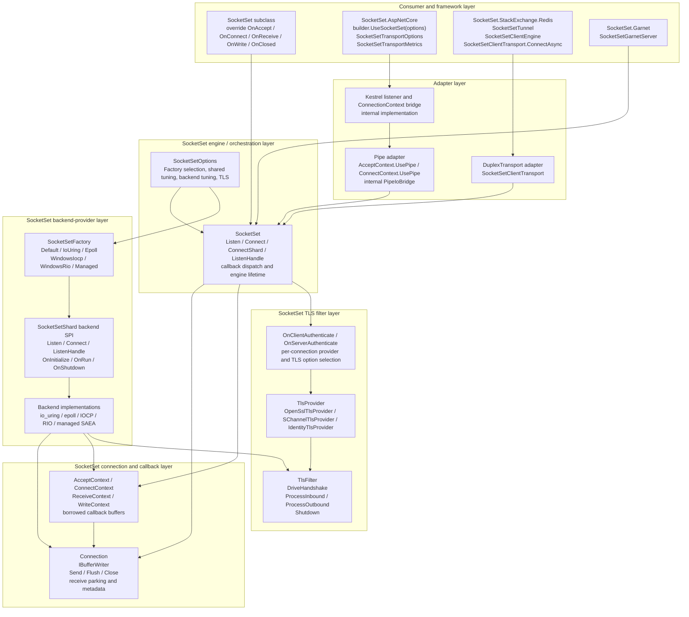
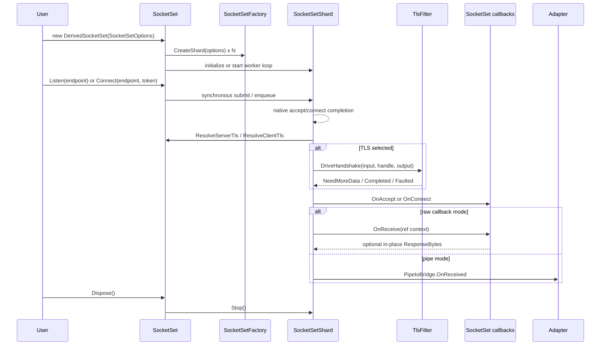

# SocketSet public API and layer map

> **Purpose:** Source-grounded inventory for comparing SocketSet's current design with the runtime transport proposal. This document describes SocketSet as it exists; it does not yet revise the proposed runtime API.
>
> **Source revision:** [`mgravell/SocketSet@adc470a8e5607ee50397a79caabf31aca7151ef9`](https://github.com/mgravell/SocketSet/tree/adc470a8e5607ee50397a79caabf31aca7151ef9)
>
> **Key finding:** SocketSet's low-level engine is not task-based. `Listen`, `Connect`, receive delivery, write completion, TLS progression, and close are synchronous submissions or callbacks. Task-based APIs appear in higher-level adapters such as the StackExchange.Redis transport.

## Layered architecture and public entry points



The most useful labels for our proposal comparison are:

- **Provider layer:** `SocketSetFactory` plus `SocketSetShard`.
- **Engine/transport layer:** `SocketSet` plus `SocketSetOptions`.
- **Connection layer:** `Connection` and the four callback contexts.
- **TLS engine layer:** `TlsProvider` plus `TlsFilter`.
- **Adapter layer:** Pipelines, Kestrel, Redis, and Garnet integrations.

This is materially different from the first runtime proposal, which put async accept/read/write/authentication methods directly on `TransportConnection`.

## End-to-end control flow



The core does asynchronous I/O internally, but its public API is callback-based:

- `Connect` is a synchronous submission that returns `void`; `OnConnect` is the completion.
- `Listen` is a synchronous bind/start operation that returns `void`; `OnAccept` is the accept notification.
- inbound data arrives through `OnReceive`.
- full write completion arrives through `OnWrite`.
- connection termination arrives through `OnClosed`.
- `Connection.Send` and `Flush` synchronously hand work to the owning I/O context and return whether it was accepted, not whether the network write completed.

The Redis adapter turns this into `ConnectAsync` with a `TaskCompletionSource`. The Kestrel adapter implements Kestrel's async listener contract internally. This is an adapter choice, not the SocketSet core contract.

## How a backend is selected

### Automatic selection

```csharp
var options = new SocketSetOptions
{
    Factory = SocketSetFactory.Default,
};
```

`SocketSetFactory.Default` is cached and evaluates in this order:

1. `WindowsIocp` when Windows is supported.
2. `IoUring` when its Linux feature probe succeeds.
3. `Epoll` when epoll is available.
4. `Managed` otherwise.

`WindowsRio` is deliberately never selected by `Default`.

### Explicit selection

```csharp
var options = new SocketSetOptions
{
    Factory = SocketSetFactory.Epoll,
};
```

The public choices are:

```csharp
SocketSetFactory.Default
SocketSetFactory.IoUring
SocketSetFactory.Epoll
SocketSetFactory.WindowsIocp
SocketSetFactory.WindowsRio
SocketSetFactory.Managed
```

Callers can inspect `factory.IsSupported` before construction. Selecting an unsupported factory fails when it creates a shard.

### Selection inside the engine

The `SocketSet` constructor:

1. reads `options.Factory`;
2. resolves zero-valued buffer geometry through `factory.DefaultGeometry`;
3. clamps the initial shard count to `factory.MaxShards`;
4. calls `factory.CreateShard(options)` for every shard;
5. starts one worker thread per shard when `factory.UsesWorkerThreads` is true, otherwise initializes the callback-driven backend inline;
6. blocks construction until every shard has initialized or the 30-second startup timeout expires.

This means provider startup is synchronous from the consumer's perspective even when the provider creates worker threads.

### Selection through the ASP.NET Core adapter

```csharp
builder.UseSocketSet(options =>
{
    options.Factory = SocketSetFactory.WindowsIocp;
});
```

`SocketSetTransportOptions.Factory` is copied into a new `SocketSetOptions.Factory` when the Kestrel listener binds.

### Selection through the Redis adapter

```csharp
var engine = new SocketSetClientEngine(
    new SocketSetOptions
    {
        Factory = SocketSetFactory.IoUring,
    });

var tunnel = new SocketSetTunnel(engine);
```

The caller can share one `SocketSetClientEngine` across tunnels or multiplexers, or pass `SocketSetOptions` to `SocketSetTunnel` and let the tunnel lazily own one engine.

## Backend choices are factory singletons, not public implementation types

The public API returns the native choices as `SocketSetFactory`. The concrete `IoUringFactory`, `EpollFactory`, `WindowsIocpFactory`, `WindowsRioFactory`, and `ManagedSocketFactory` types are internal.

This has two consequences:

- consumers select a backend without taking a compile-time dependency on its concrete factory type;
- provider-specific public configuration cannot naturally live on the concrete factory because the concrete type is hidden, so SocketSet puts backend-specific tuning into the shared `SocketSetOptions` bag.

## Windows IOCP and RIO

Both should appear in our future proposal diagrams, but they should not be described as interchangeable equivalents.

| Backend | Role in SocketSet | Relationship to io_uring |
|---|---|---|
| Windows IOCP | Default Windows backend; raw Winsock completion-port engine; supports TCP and AF_UNIX | The closest Windows counterpart to a general completion engine, although the API and kernel model differ substantially from io_uring |
| Windows RIO | Explicit registered-I/O TCP data-path accelerator; uses registered buffers and request/completion queues; still relies on IOCP-related infrastructure for parts such as accept/connect/notification | Similar to io_uring only in the broad sense of explicit queues and registered resources; it is a narrower Winsock extension, TCP-only in this implementation, and not a general operation framework |

SocketSet's source and README both treat RIO as workload-sensitive and opt-in. It should be a provider option in experiments, not presented as the automatic Windows answer.

## Core engine public API

Condensed reference-style surface:

```csharp
namespace SocketSets;

public abstract partial class SocketSet : IDisposable
{
    protected SocketSet(SocketSetOptions options);

    public SocketSetOptions Options { get; }
    public virtual string Name { get; }
    public bool SupportsEndpointTracking { get; }
    public long Timeouts { get; }
    public long ShardsGrown { get; }
    public long PlacementFailures { get; }

    public void Listen(EndPoint endpoint, object? userToken = null);
    public void ListenHandle(nint handle, object? userToken = null);
    public void Connect(EndPoint endpoint, object? userToken = null);
    public void ConnectShard(int shardIndex, EndPoint endpoint, object? userToken = null);

    protected internal virtual bool OnClientAuthenticate(ref TlsClientAuthenticateContext context);
    protected internal virtual bool OnServerAuthenticate(ref TlsServerAuthenticateContext context);
    protected internal virtual void OnAccept(ref AcceptContext context);
    protected internal virtual void OnConnect(ref ConnectContext context);
    protected internal virtual void OnReceive(ref ReceiveContext context);
    protected internal virtual void OnWrite(ref WriteContext context);
    protected internal virtual void OnLoopDrain();
    protected internal virtual void OnClosed(Connection connection);
    protected internal virtual void OnWorkerFaulted(Exception exception);
    protected virtual void OnTimeout(Connection connection, string reason);
    protected virtual void OnCallbackFaulted(Connection connection, string callback, Exception exception);
    protected virtual void OnTlsFault(Connection connection, string reason);
    protected virtual void Dispose(bool disposing);

    public void Dispose();
}
```

The engine combines several responsibilities:

- provider selection;
- provider construction and startup;
- listener registration;
- outbound connection submission;
- capacity placement and shard growth;
- TLS selection;
- callback dispatch;
- transport diagnostics;
- whole-engine disposal.

There is no public listener object and no public connect-operation object. Listener lifetime and connection-attempt lifetime are subordinate to the entire `SocketSet`.

## Core configuration API

```csharp
public class SocketSetOptions
{
    public SocketSetFactory Factory { get; set; } = SocketSetFactory.Default;

    public int Shards { get; set; } = 4;
    public int MaxShards { get; set; }
    public int SocketsPerShard { get; set; } = 4096;
    public bool PinWorkerThreads { get; set; } = true;

    public int EntriesPerShard { get; set; } = 4096;
    public int BufferPageSize { get; set; }
    public int BufferPagesPerShard { get; set; }
    public int ReceiveBufferSize { get; set; }
    public int WriteBuffersPerShard { get; set; }
    public int OutOfBandWriteBuffersPerShard { get; set; }
    public int MaxBorrowedReadBuffers { get; set; } = 128;

    public bool ReusePort { get; set; } = true;
    public int UnixSocketMode { get; set; } = 0b110_000_000;
    public int ListenBacklog { get; set; } = 512;
    public int AcceptConcurrency { get; set; } = 32;
    public bool ResetOnClose { get; set; }

    public TimeSpan HandshakeTimeout { get; set; } = TimeSpan.FromSeconds(10);
    public TimeSpan IdleTimeout { get; set; }
    public int MaxInboundBufferBytes { get; set; } = 4 * 1024 * 1024;
    public bool DangerousDisableBufferWipe { get; set; }
    public bool TrackEndpoints { get; set; } = true;

    public TlsProvider? Tls { get; set; }
    public TlsMode TlsMode { get; set; } = TlsMode.Both;
    public TlsClientOptions TlsClient { get; set; } = new();
    public TlsServerOptions TlsServer { get; set; } = new();
}
```

### Which options belong to which backend

| Option | Shared semantic or backend usage |
|---|---|
| `Factory` | Selects the backend |
| `Shards`, `MaxShards`, `SocketsPerShard` | Shared engine topology; managed caps itself to one shard |
| `PinWorkerThreads` | Native loop-thread backends; irrelevant to managed SAEA |
| `EntriesPerShard` | io_uring submission/completion ring capacity |
| `BufferPageSize` | Shared outbound page concept used by native backends; backend default may differ |
| `BufferPagesPerShard` | Primarily io_uring provided-buffer pool |
| `ReceiveBufferSize` | Used by every backend's receive storage model |
| `WriteBuffersPerShard` | Native preallocated write-pool depth |
| `OutOfBandWriteBuffersPerShard` | io_uring out-of-band write pool |
| `MaxBorrowedReadBuffers` | io_uring limit for sends retaining provided receive buffers |
| `ReusePort` | Linux epoll/io_uring IP multi-bind |
| `UnixSocketMode` | Linux filesystem Unix-domain listener permission |
| `ListenBacklog` | Shared listener semantic |
| `AcceptConcurrency` | IOCP and RIO outstanding `AcceptEx` depth |
| `ResetOnClose` | Shared close policy |
| timeout, inbound bound, wipe, endpoint tracking | Shared behavior, implemented by each backend |
| TLS properties | Shared engine TLS selection, interpreted by each backend/TLS provider combination |

SocketSet does expose epoll, io_uring, IOCP, and RIO tuning, but it exposes them in one shared options type. It does not currently have `EpollOptions`, `IoUringOptions`, `IocpOptions`, or `RioOptions`.

This is useful evidence for our redesign: backend tuning is necessary, but putting every backend's implementation mechanics into the common options type makes it difficult to know which settings are honored.

## Provider selection API

```csharp
public abstract class SocketSetFactory
{
    protected SocketSetFactory();

    public static SocketSetFactory Default { get; }
    public static SocketSetFactory IoUring { get; }
    public static SocketSetFactory Epoll { get; }
    public static SocketSetFactory WindowsIocp { get; }
    public static SocketSetFactory WindowsRio { get; }
    public static SocketSetFactory Managed { get; }

    public abstract bool IsSupported { get; }
    public abstract SocketSetShard CreateShard(SocketSetOptions options);
    public virtual bool UsesWorkerThreads { get; }
    public virtual bool CanMultiBind(EndPoint endpoint, SocketSetOptions options);
    public virtual int MaxShards { get; }
    public virtual BufferGeometry DefaultGeometry { get; }
}

public sealed class BufferGeometry
{
    public BufferGeometry(
        int pageSize,
        int receiveBufferSize,
        int writeBuffersPerShard,
        int outOfBandWriteBuffersPerShard,
        int bufferPagesPerShard);

    public int PageSize { get; }
    public int ReceiveBufferSize { get; }
    public int WriteBuffersPerShard { get; }
    public int OutOfBandWriteBuffersPerShard { get; }
    public int BufferPagesPerShard { get; }

    public static BufferGeometry Default { get; }
    public static BufferGeometry ForPage(
        int pageSize,
        int receiveBufferSize,
        int poolBytes = 4 * 1024 * 1024);
}
```

`SocketSetFactory` is both:

- the consumer-facing provider selector;
- the backend SPI factory that creates shards and declares topology/capabilities/default geometry.

That combination is compact, but it also means a public consumer concept exposes backend-construction SPI.

## Backend SPI

```csharp
public abstract class SocketSetShard
{
    public static int CurrentShardIndex { get; }

    protected SocketSet Parent { get; }
    protected int Shard { get; }
    protected bool IsActive { get; }
    protected bool IsLoopThread { get; }

    protected void SetShardCapacity(int slots);
    protected bool TakeSweepRequest();
    protected void MaybeSweep();

    protected virtual void OnInitialize();
    protected abstract void OnRun();
    protected virtual void OnStop();
    protected virtual void OnShutdown();
    protected virtual void Wake();
    protected virtual void SweepTimeouts(long nowTicks);
    protected internal virtual bool SupportsEndpointTracking { get; }

    public virtual void Listen(EndPoint endpoint, object? userToken, bool local);
    public virtual void Connect(EndPoint endpoint, object? userToken);
    public virtual void ListenHandle(nint handle, object? userToken);
    public void Stop();
}
```

A third-party backend also needs a `Connection` subclass, because the built-in backends store their per-connection fd/socket/slot state there and implement its abstract write and close methods.

The SPI therefore consists of three public inheritance points:

1. `SocketSetFactory`;
2. `SocketSetShard`;
3. `Connection`.

The provider gets the entire `SocketSetOptions` object, including options that may not apply to it. The common SPI does not have a typed validation or "option was ignored" result.

## Connection API

```csharp
public abstract class Connection : IBufferWriter<byte>
{
    public object? UserToken { get; set; }

    public string? NegotiatedProtocol { get; }
    public string? RequestedServerName { get; }
    public PeerAddress RemoteAddress { get; }
    public PeerAddress LocalAddress { get; }

    public virtual bool SupportsReceiveParking { get; }
    public bool TryPauseReceive();
    public void ResumeReceive();
    public static long TotalReceiveParks { get; }

    public abstract void Close();

    public abstract Span<byte> GetSpan(int sizeHint = 0);
    public abstract Memory<byte> GetMemory(int sizeHint = 0);
    public abstract void Advance(int count);
    public abstract bool Flush();

    public virtual bool Send(ReadOnlySpan<byte> data);
    public virtual bool Send(in ReadOnlySequence<byte> data);
}
```

The connection has no public read method. Reads belong to the owning backend and are delivered through `SocketSet.OnReceive`. The connection is primarily:

- stable connection identity;
- application state through `UserToken`;
- cross-thread outbound writer;
- close handle;
- receive-backpressure control;
- post-handshake metadata.

This is the key SocketSet design choice: **the low-level data plane is push/callback-based, not an async duplex-stream API**.

Connection endpoints use a custom allocation-free value type:

```csharp
public readonly struct PeerAddress : IEquatable<PeerAddress>
{
    public bool IsSet { get; }
    public AddressFamily Family { get; }
    public int Port { get; }
    public bool IsLoopback { get; }

    public static PeerAddress Unix { get; }
    public static PeerAddress FromIPv4(uint addressNetworkOrder, ushort port);
    public static PeerAddress FromIPv6(ReadOnlySpan<byte> address16, ushort port, uint scopeId);
    public static PeerAddress FromSockAddr(ReadOnlySpan<byte> sockaddr);
    public static PeerAddress FromEndPoint(EndPoint? endPoint);

    public bool TryGetAddressBytes(Span<byte> destination, out int written);
    public bool TryFormat(Span<char> destination, out int charsWritten);
    public IPEndPoint? ToIPEndPoint();
}
```

## Callback context API

All four contexts are nested `protected internal ref struct` types on `SocketSet`. Their buffers are borrowed for the callback invocation.

### Accept and connect

```csharp
public readonly Connection Connection { get; }
public readonly void CloseOutput();
public readonly void CloseInput();
public readonly void UsePipe(IDuplexPipe pipe, bool pinned = false);
public Span<byte> SendBuffer { get; }
public Span<byte> GetWriteSpan(int sizeHint);
public Span<byte> SendBufferUnwiped { get; }
public int SendBytes { get; set; }
public readonly SocketFlags Flags { get; }
```

### Receive

```csharp
public readonly Connection Connection { get; }
public readonly int PayloadBytes { get; }
public readonly ReadOnlySpan<byte> Payload { get; }
public Span<byte> RawBuffer { get; }
public Span<byte> GetWriteSpan(int sizeHint);
public Span<byte> RawBufferUnwiped { get; }
public readonly bool IsEof { get; }
public int ResponseBytes { get; set; }
public readonly SocketFlags Flags { get; }
public readonly void CloseInput();
```

### Write completion

```csharp
public readonly Connection Connection { get; }
public Span<byte> SendBuffer { get; }
public Span<byte> GetWriteSpan(int sizeHint);
public Span<byte> SendBufferUnwiped { get; }
public int SendBytes { get; set; }
public readonly SocketFlags Flags { get; }
public readonly void CloseOutput();
```

The contexts optimize for callback-local work:

- data is exposed as `Span<byte>`/`ReadOnlySpan<byte>`;
- a response can reuse the receive or just-completed send buffer;
- a callback can pipeline another write without allocating a task or operation object;
- `ref struct` prevents retaining the borrowed buffer beyond the callback.

That shape is difficult to expose through an ordinary `Socket` API because the buffer and callback are owned by the provider, not supplied by the caller.

## TLS provider and filter API

SocketSet has a lower-level TLS SPI than the first runtime proposal.

```csharp
public abstract class TlsProvider
{
    public abstract TlsFilter CreateClientFilter(TlsClientOptions options);
    public abstract TlsFilter CreateServerFilter(TlsServerOptions options);
    public virtual bool SupportsKernelOffload { get; }
    public virtual string Name { get; }
}

public abstract class TlsFilter : IDisposable
{
    public bool HandshakeComplete { get; protected set; }
    public string? NegotiatedProtocol { get; protected set; }
    public string? FaultReason { get; protected set; }
    public string? RequestedServerName { get; protected set; }
    public TlsCryptoMode InboundCrypto { get; protected set; }
    public TlsCryptoMode OutboundCrypto { get; protected set; }
    public bool NeedsRecordType { get; }

    public abstract TlsHandshakeStatus DriveHandshake(
        ReadOnlySpan<byte> input,
        nint transportHandle,
        IBufferWriter<byte> output);

    public abstract TlsInboundStatus ProcessInbound(
        ReadOnlySpan<byte> input,
        TlsContentType contentType,
        IBufferWriter<byte> plaintext,
        IBufferWriter<byte> output);

    public abstract void ProcessOutbound(
        ReadOnlySpan<byte> plaintext,
        IBufferWriter<byte> output);

    public virtual void Shutdown(IBufferWriter<byte> output);
    public virtual void Dispose();
}
```

Built-in public TLS providers:

```csharp
new OpenSslTlsProvider(
    serverCertPem,
    serverKeyPem,
    trustCertPem,
    verifyServer,
    kernelOffload,
    minProtocol);

new SChannelTlsProvider(
    serverCertificate,
    trustCertificate,
    verifyServer,
    minProtocol,
    revocationMode);

new IdentityTlsProvider(); // test-only no-crypto filter
```

TLS is chosen globally through:

```csharp
options.Tls = provider;
options.TlsMode = TlsMode.Accept | TlsMode.Connect;
```

It can then be changed per connection by overriding:

```csharp
protected override bool OnClientAuthenticate(
    ref TlsClientAuthenticateContext context);

protected override bool OnServerAuthenticate(
    ref TlsServerAuthenticateContext context);
```

The ref contexts let the callback change `Provider`, ALPN, kTLS permission, and client target/SNI before the handshake begins.

The public option and status types are:

```csharp
[Flags]
public enum TlsMode
{
    Accept = 1,
    Connect = 2,
    Both = Accept | Connect,
}

public enum TlsProtocol
{
    Tls12,
    Tls13,
}

public sealed class TlsClientOptions
{
    public string? TargetHost { get; set; }
    public string? ServerNameIndication { get; set; }
    public bool AllowKernelOffload { get; set; } = true;
    public IReadOnlyList<string>? AlpnProtocols { get; set; }
}

public sealed class TlsServerOptions
{
    public bool AllowKernelOffload { get; set; } = true;
    public IReadOnlyList<string>? AlpnProtocols { get; set; }
}

public enum TlsCryptoMode
{
    Transform,
    KernelPassthrough,
}

public enum TlsHandshakeStatus
{
    NeedMoreData,
    Completed,
    Faulted,
}

public enum TlsInboundStatus
{
    Ok,
    PeerClosed,
    Faulted,
}
```

### Important TLS limitations visible in the API

- `OnServerAuthenticate` runs before ClientHello input exists, so it cannot select a certificate from SNI.
- `TlsServerOptions` currently exposes only ALPN and `AllowKernelOffload`.
- `TlsClientOptions` currently exposes target/SNI, ALPN, and `AllowKernelOffload`.
- the public `TlsFilter` contract is a synchronous push transform, which is useful for memory-BIO and Schannel token models;
- fd-bound OpenSSL with kTLS is implemented through backend knowledge of the concrete `OpenSslTlsProvider`, including internal methods outside the public `TlsProvider`/`TlsFilter` SPI.

That final point matters for our redesign: SocketSet's public TLS SPI is not sufficient to implement every built-in TLS path as a completely independent provider.

## ASP.NET Core adapter API

The actual Kestrel listener, connection, and pipe bridge types are internal. The public entry point is:

```csharp
public static WebApplicationBuilder UseSocketSet(
    this WebApplicationBuilder builder,
    Action<SocketSetTransportOptions>? configure = null);
```

Public configuration:

```csharp
public sealed class SocketSetTransportOptions
{
    public SocketSetFactory Factory { get; set; } = SocketSetFactory.Default;
    public int Shards { get; set; }
    public bool PinWorkerThreads { get; set; }
    public TlsProvider? Tls { get; set; }
    public SocketSetBridgeMode Mode { get; set; } = SocketSetBridgeMode.Byo;
    public bool PipePinned { get; set; } = true;
    public int PipeSegment { get; set; }
    public int PageSize { get; set; }
    public int ReceiveBufferSize { get; set; }
    public int WriteBuffers { get; set; }
    public long MaxInboundBufferBytes { get; set; } = 4 * 1024 * 1024;
}

public enum SocketSetBridgeMode
{
    Classic,
    Byo,
    HalfPipe,
}
```

The adapter also exposes:

```csharp
public interface ITransportTlsFeature
{
    string? NegotiatedProtocol { get; }
}

public sealed class SocketSetTransportMetrics
{
    public long Accepts { get; }
    public long Closes { get; }
    public long ClosedEmpty { get; }
    public long WriteFail { get; }
    public long SendFalse { get; }
    public string? ResolvedGeometry { get; }
    public long InboundOverflow { get; }
    public long ReceiveParks { get; }
}
```

The bridge mode is adapter policy, not backend selection:

- `Classic`: copy to/from ordinary pipes and use a pump;
- `Byo`: hand Kestrel's pipes to `AcceptContext.UsePipe`;
- `HalfPipe`: use a custom outbound `PipeWriter`.

### Source-visible adapter questions

- `SocketSetTransportOptions.Shards` says zero lets the backend choose, but it is copied to `SocketSetOptions.Shards`, whose constructor currently clamps zero to one. The public description and implementation do not currently express a backend-chosen count.
- `SocketSetTransportOptions` exposes only a subset of `SocketSetOptions`, so an ASP.NET consumer cannot configure several engine/provider settings through the adapter.
- TLS is represented as one `TlsProvider`; the adapter does not expose the core per-connection TLS callbacks.

These are useful examples of why provider options and adapter options should have explicit ownership in our proposal.

## StackExchange.Redis adapter API

```csharp
public sealed class SocketSetClientEngine : SocketSet
{
    public SocketSetClientEngine(SocketSetOptions options);
}

public sealed class SocketSetClientTransport : DuplexTransport
{
    public static Task<SocketSetClientTransport> ConnectAsync(
        EndPoint endpoint,
        SocketSetClientEngine engine,
        CancellationToken cancellationToken = default);

    public static Task<SocketSetClientTransport> ConnectAsync(
        EndPoint endpoint,
        SocketSetOptions options,
        CancellationToken cancellationToken = default);

    public override Memory<byte> GetMemory(int sizeHint = 0);
    public override Span<byte> GetSpan(int sizeHint = 0);
    public override void Advance(int count);
    public override bool Flush();
    public override void Start(TransportReceiver receiver);
    public override ValueTask DisposeAsync();
}

public sealed class SocketSetTunnel : Tunnel
{
    public SocketSetTunnel(SocketSetClientEngine engine);
    public SocketSetTunnel(SocketSetOptions options);

    public override ValueTask<DuplexTransport?> ConnectTransportAsync(
        EndPoint endpoint,
        ConnectionType connectionType,
        CancellationToken cancellationToken);
}
```

This adapter demonstrates the split we should preserve:

- the low-level engine submits `Connect` and reports `OnConnect`;
- the adapter creates a `TaskCompletionSource` and exposes `ConnectAsync`;
- the shared engine remains the provider/worker/pool owner;
- the per-connection `DuplexTransport` is a protocol-library adapter.

The adapter also exposes a real weakness of the callback contract: `OnClosed` carries no terminal exception, so it reports a generic `IOException` when a connection closes before establishment and passes `null` to the protocol receiver after establishment.

## Garnet adapter API

```csharp
public sealed class SocketSetGarnetServer : GarnetServerBase, IServerHook
{
    public SocketSetGarnetServer(
        EndPoint endpoint,
        SocketSetOptions options,
        int serverBufferSize = 1 << 17,
        ILogger? logger = null);

    public override void Start();
    public override void Close();
    public override IEnumerable<IMessageConsumer> ActiveConsumers();
    public override IEnumerable<IClusterSession> ActiveClusterSessions();
    public bool TryCreateMessageConsumer(...);
    public void DisposeMessageConsumer(...);
    public override void Dispose();
}
```

This is further evidence that the callback engine can sit below unrelated server stacks, but it does not by itself justify every core type as stable BCL API.

## What SocketSet gets right for our discussion

1. **Synchronous does not mean blocking.** `Connect` can enqueue native asynchronous work and return; the completion is a callback.
2. **The provider is selected explicitly.** `SocketSetOptions.Factory` is the central choice, with a usable automatic `Default`.
3. **The provider owns shared resources.** One `SocketSet` creates and owns N shards, threads, rings/ports, pools, and connections.
4. **The low-level connection is not a second Socket.** It omits accept/connect/read methods and acts as identity, outbound writer, close control, and metadata.
5. **Provider-owned buffers are explicit.** Callback `ref struct`s make the borrow lifetime lexical.
6. **TLS is a low-level state machine.** `TlsFilter` is driven synchronously by the transport loop instead of presenting a top-level `AuthenticateAsServerAsync` method.
7. **Async can be added above.** Redis and Kestrel adapters convert callback completion into the async/Pipelines shapes their consumers require.
8. **Both Windows providers are modeled.** IOCP is the default general provider; RIO is explicit and workload-sensitive.

## What should not be copied blindly

1. **One options bag mixes portable policy and backend mechanics.** A user can set `EntriesPerShard` while using IOCP or `AcceptConcurrency` while using epoll, with no typed indication that the setting is irrelevant.
2. **One object owns too many lifetimes.** `SocketSet` owns every listener and connection attempt; there is no listener handle for independent stop/dispose.
3. **Connect failure correlation is weak.** `Connect` returns `void`, so the caller routes results through `UserToken` and callbacks; there is no first-class attempt/result identity.
4. **Close errors are lossy.** `OnClosed(Connection)` has no error or close reason.
5. **The public provider SPI exposes many implementation details.** `SocketSetShard`, `Connection`, raw `nint` TLS handles, and `SocketSetOptions` are all part of the inheritance contract.
6. **TLS provider SPI and built-in fd-bound kTLS path diverge.** Some built-in behavior depends on concrete OpenSSL knowledge outside the public abstraction.
7. **Server ClientHello policy is incomplete.** The pre-handshake server callback cannot see the ClientHello.
8. **Buffer APIs are efficient but specialized.** In-place reply buffers and unwiped escape hatches are appropriate for an experimental engine, but too sharp to adopt as a general BCL API without a narrower target audience.
9. **Provider startup blocks the constructor.** That is clear operationally, but constructor-time threads, native allocation, and a 30-second wait are difficult to compose and cancel.
10. **`Default` is convenient but global and cached.** The same binary selects different behavior across hosts, and a process cannot re-probe after environment changes.

## Direct answers to the current proposal questions

### 1. Which layer was the first proposal discussing?

Yes: most API after "Core connection contract" was proposed `TransportConnection` and adapter behavior, but the document did not label the layer transition clearly enough. SocketSet shows at least five distinct layers, so the main proposal diagram should tag each box with its layer while retaining the current box names.

The first proposal also placed operations from several layers on `TransportConnection`:

- transport I/O;
- accept/connect result model;
- TLS handshake orchestration;
- ClientHello observation;
- graceful TLS shutdown;
- offload result reporting.

We should decide which of those belong on the low-level connection before editing the diagram.

### 2. Does the low-level API need to be async?

Not necessarily. SocketSet is evidence for a credible alternative:

- synchronous submission methods;
- callback completion;
- lexical borrowed buffers;
- async adapters above.

This avoids per-operation `Task`/`ValueTask` state in the core API, although the implementation still tracks native operations, cancellation, and buffer lifetime. Those native lifetimes do not disappear with a synchronous API; they move from task sources to callback/slot state.

The strongest reason to avoid making the low-level API look like `Socket.ReceiveAsync`/`SendAsync` is exactly your concern: if its public shape is nearly the same, the burden is on us to explain why the implementation cannot remain behind `Socket`. A callback/push engine with provider-selected buffers, shared shards, batch callbacks, and synchronous TLS-filter progression is a more distinct low-level contract.

The strongest counterargument is usability: callback engines are harder to compose, connect cancellation/result correlation becomes awkward, and most .NET protocol code expects Tasks, Streams, or Pipelines. A likely layering is therefore:

1. low-level provider engine with synchronous submit plus completion callbacks;
2. optional async connection adapter;
3. Pipelines/Kestrel/client adapters.

### 3. Should the backend summary include IOCP and RIO?

Yes. IOCP should be the main Windows provider. RIO should be an additional explicit registered-I/O provider, with its TCP-only and workload-sensitive nature called out. RIO is not simply "Windows io_uring"; it is narrower and in SocketSet still uses IOCP-related infrastructure around the RIO data path.

### 4. Should ClientHello observation be a callback?

At the low-level layer, yes.

An fd-bound OpenSSL server does not need a memory BIO or a raw socket peek to expose ClientHello. OpenSSL's ClientHello callback runs from `SSL_do_handshake` after OpenSSL has read and parsed the ClientHello through the socket BIO. The callback can return a retry/suspend result; `SSL_do_handshake` then returns a corresponding `WANT_CLIENT_HELLO_CB` state. The application runs user work elsewhere and retries the same handshake later.

The current DirectTLS study follows the same shape through the runtime TLS session: the pump advances the fd-bound handshake until the session reports that it needs a TLS context, copies the parsed ClientHello record from the session, suspends the handshake while the user callback runs, and resumes it on the pump thread. No memory BIO is required.

That supports a registered callback on the TLS/provider configuration, not a consumer call named `ObserveTlsClientHelloAsync`. The separate-invocation API in the first proposal was added to mimic Kestrel's separate listener timeout, but it is the wrong abstraction for the low-level layer. A higher Kestrel adapter can implement separate timeout accounting around a callback phase exposed by the handshake state machine.

### 5. Why was listener acquisition and disposal async?

`await using TransportListener listener = await provider.ListenAsync(...)` combined two independent choices:

- the right-hand `await` meant listener creation/bind/start could be asynchronous;
- `await using` meant disposal could asynchronously drain native work.

SocketSet demonstrates that bind/start can instead be synchronous and fail before returning. The only inherently asynchronous part is waiting for worker shutdown or terminal completions during disposal.

For the low-level API, a clearer candidate is:

```csharp
using TransportListener listener = provider.Listen(options);
```

or:

```csharp
TransportListener listener = provider.CreateListener(options);
listener.Start();
```

with `DisposeAsync` only if shutdown really needs an awaitable drain. We should not keep async listener creation merely because Kestrel's factory API is async.

### 6. Should TLS authentication be below or above `TransportConnection`?

SocketSet makes the lower-level alternative concrete:

- transport/provider selects a `TlsProvider`;
- backend creates a per-connection `TlsFilter`;
- the I/O loop drives `DriveHandshake`, `ProcessInbound`, `ProcessOutbound`, and `Shutdown`;
- application callbacks see a connection only after the selected handshake completes.

That is a better starting point for the low-level runtime design than putting `AuthenticateAsServerAsync` directly on the base connection. A higher `System.Net.Sockets`-style or `System.Net.Security` adapter can expose a convenient authenticate method.

The remaining hard question is where TLS policy selection lives. It cannot be just backend internals because Kestrel needs rich callbacks, but it also should not turn the transport connection into a high-level `SslStream` replacement.

### 7. Does the API review critique still stand?

The main verdict still stands: do not stabilize a second networking surface before the need and layer boundaries are proven.

Some shape-specific critique should be rerun after this discussion because the candidate architecture may change from an async connection API to a lower-level callback/provider SPI. The review remains useful as a guardrail, not as a final rejection of all runtime work.

## Candidate comparison for the next batch

| Design question | First runtime proposal | SocketSet evidence | Next decision |
|---|---|---|---|
| Core completion model | `ValueTask` accept/read/write/authenticate | synchronous submit plus callbacks | Decide whether callback SPI is the true core |
| Listener lifetime | async listener object | listeners owned by whole engine | Keep a listener object, but decide sync start and async drain separately |
| Connection read API | provider-owned `ReadOnlySequence` plus `AdvanceRead` | no read API; callback receives borrowed `ReadOnlySpan` | Compare lexical callback borrow with retained sequence lease |
| Connection write API | `WriteAsync(ReadOnlySequence)` | `IBufferWriter`/`Flush`, `Send`, and write-completion callback | Decide whether completion is callback, token, or optional async adapter |
| TLS | authenticate methods on connection | provider/filter state machine driven by backend | Move low-level TLS to provider/filter layer |
| ClientHello | separate async method plus callback | should arise during handshake | Use a handshake callback/state transition |
| Backend selection | concrete provider constructors | `SocketSetFactory` static choices plus `Default` | Design explicit provider registry/factory and typed options |
| Backend tuning | deliberately absent from common API | one shared bag with real epoll/io_uring/IOCP/RIO knobs | Add typed provider options without polluting common semantics |
| Windows | managed Socket plus possible IOCP | explicit IOCP and RIO | Include both, with IOCP as general/default candidate |
| Adapters | Pipelines directly over async connection | async/Pipelines built above callback engine | Preserve adapter separation |

## Proposed next batch

The next API discussion should start below TLS convenience and below Pipelines:

1. provider selection and provider-specific options;
2. provider/engine lifetime;
3. listener creation, bind, start, stop, and ownership;
4. connection identity and connect-attempt correlation;
5. callback versus retained-buffer read completion;
6. write submission and completion;
7. terminal close/error model.

Only after those are coherent should we place TLS callbacks and higher-level async adapters.

## Pinned source index

- [`SocketSet`](https://github.com/mgravell/SocketSet/blob/adc470a8e5607ee50397a79caabf31aca7151ef9/src/SocketSet/SocketSet.cs)
- [`SocketSetOptions`](https://github.com/mgravell/SocketSet/blob/adc470a8e5607ee50397a79caabf31aca7151ef9/src/SocketSet/SocketSetOptions.cs)
- [`SocketSetFactory`](https://github.com/mgravell/SocketSet/blob/adc470a8e5607ee50397a79caabf31aca7151ef9/src/SocketSet/SocketSetFactory.cs)
- [`SocketSetShard`](https://github.com/mgravell/SocketSet/blob/adc470a8e5607ee50397a79caabf31aca7151ef9/src/SocketSet/SocketSetShard.cs)
- [`Connection`](https://github.com/mgravell/SocketSet/blob/adc470a8e5607ee50397a79caabf31aca7151ef9/src/SocketSet/Connection.cs)
- [`TlsProvider`](https://github.com/mgravell/SocketSet/blob/adc470a8e5607ee50397a79caabf31aca7151ef9/src/SocketSet/Tls/TlsProvider.cs)
- [`TlsFilter`](https://github.com/mgravell/SocketSet/blob/adc470a8e5607ee50397a79caabf31aca7151ef9/src/SocketSet/Tls/TlsFilter.cs)
- [`TlsAuthenticateContext`](https://github.com/mgravell/SocketSet/blob/adc470a8e5607ee50397a79caabf31aca7151ef9/src/SocketSet/Tls/TlsAuthenticateContext.cs)
- [`SocketSet.AspNetCore` public options](https://github.com/mgravell/SocketSet/blob/adc470a8e5607ee50397a79caabf31aca7151ef9/src/SocketSet.AspNetCore/SocketSetTransportOptions.cs)
- [`SocketSet.AspNetCore` registration](https://github.com/mgravell/SocketSet/blob/adc470a8e5607ee50397a79caabf31aca7151ef9/src/SocketSet.AspNetCore/SocketSetBuilderExtensions.cs)
- [`SocketSet.StackExchange.Redis` adapter](https://github.com/mgravell/SocketSet/blob/adc470a8e5607ee50397a79caabf31aca7151ef9/src/SocketSet.StackExchange.Redis/SocketSetTransport.cs)
- [`SocketSetTunnel`](https://github.com/mgravell/SocketSet/blob/adc470a8e5607ee50397a79caabf31aca7151ef9/src/SocketSet.StackExchange.Redis/SocketSetTunnel.cs)
- [OpenSSL 3.5.2 ClientHello callback](https://github.com/openssl/openssl/blob/openssl-3.5.2/doc/man3/SSL_CTX_set_client_hello_cb.pod)
